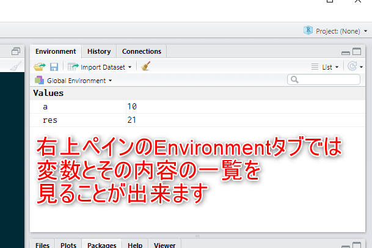
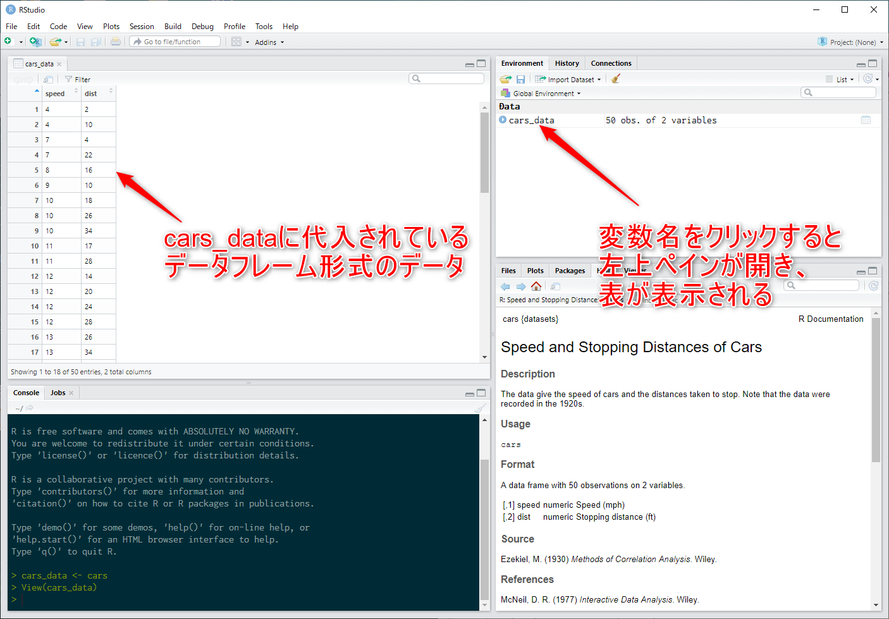
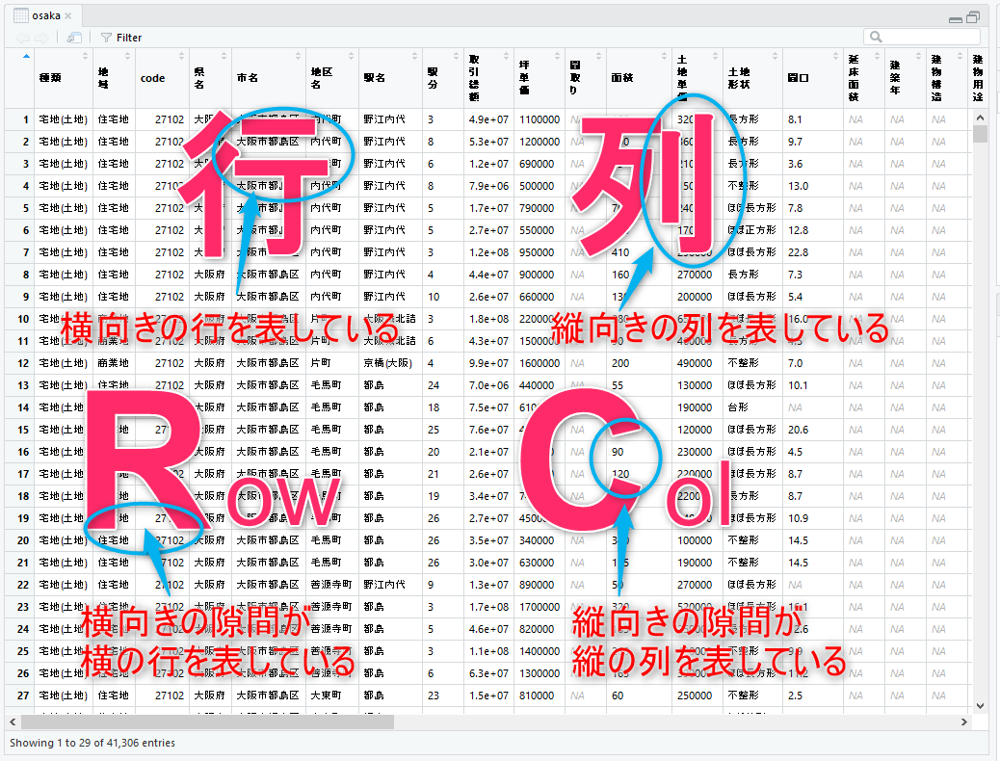

# コンソールとコマンド

## コマンド

プロンプトに対して渡すコマンドの基本形を見てみましょう。

### 四則演算

プロンプトに対して、通常の四則演算式を入力すれば、
電卓変りに使うことが出来ます。

```{r}
# 四則演算
(350 + 120) * (100 - 20) / (10 * 10)
```

### 関数

通常のコマンドは、Rの**関数**を入力して実行します。
まずは、現在の時間を教えてくれる`date()`という関数を試してみましょう。

```{r}
# 現在の時刻を表示する関数
date()
```

関数には決まったパターンがあります。
`date()`を見て把握できる通り、関数は、必ず、関数名とそれに続く括弧から成り立っています。
上記の例である`date()`は、かっこの中に何も書いてありませんでしたが、
括弧の中には**引数**と呼ばれるものが入ることもあります。
引数は、「ひきすう」と読みます。

では、引数をとる関数を試してみましょう。`sum()`関数は、引数として渡された数字の合計を返してくれます。


```{r}
# 引数として渡された数字を合計するsum()関数
sum(1, 2, 3, 4, 5)
```

この様に複数にカンマを使って区切ることで、関数には複数の引数を渡すことが出来ます。

関数の引数は、その各関数によって、どのような引数を取るのかが決まっています。
また、その引数の場所に意味があったり、
引数を省略すると自動的に既定値（デフォルト値）をとることもあります。

このような引数に関するルールについては、のちに学習することになりますが、
ここでは、まず、関数は引数を取ることがあるという基本的な事を把握できれば十分です。


## 履歴機能

先のsum()関数では、1から5までの数字を合計しました。
次は、１から6までの数字を合計したいとしましょう。
実際の計算作業においても、
一度行った計算の一部を調整して、再度、似たような計算を行うこともあると思います。
そんな、作業をサポートしてくれるのが履歴機能です。

コンソールにフォーカスがある状態で、カーソルキーの**上矢印"↑"をキー**押してください。
（図\@ref(fig:cursorkey001)）
前回実行したコマンドがプロンプト上に入力された状態になりましたか？
何度もこのカーソルの上矢印キーを押すと、
どんどん、前に入力して実行したコマンドに変わっていくはずです。
これを**履歴機能**と呼びます。
今度は、**下矢印"↓"キー**を押して下さい。
そうです、行き過ぎたら戻ればよいわけです。

```{r cursorkey001, echo=FALSE, out.width="70%", fig.cap="キーボードのカーソルキー"}

```

このように、面倒で複雑なコマンドも１度入力してしまえば、
いつでも指一本で簡単に呼び出せるようになります。
ですから、似たようなコマンドは１から打ち込むことなく、
以前実行したコマンドを再度呼び出し、
必要な部分のみを修正するだけでよくなるので、入力が格段に簡単になります。

では、1から6までの合計値を計算してみてください。

```{r}
# 履歴を活用して1から6の合計値を計算する
sum(1, 2, 3, 4, 5, 6)
```

## 補完機能


## 変数と代入

プログラミングをしたことが無い人ならば、
まずは単純に、変数とは名前の付いたデータの入れ物だと考えればＯＫです。

a という変数に、10という数を入れるならば、次のように書きます。

```{r}
# 変数に値を代入する
a <- 10
```

`<-`の部分は、変数にデータを代入する代入記号です。
`<`（小なり記号）と、`-`（ハイフン）の２文字を使って矢印のような形を書き込むことになりますが、
RStudio上では、Altキーと`-`ハイフンキーを同時押しすれば、一発で書き込むことが出来ます。

変数への代入を行うと、その代入された値はコンピューターの中に保持されます。
そして、RStudioは変数とその値についての情報を
右上ペインの`Environment`タブにまとめて表示してくれます。（図\@ref(fig:envtab001)）

```{r envtab001, echo=FALSE, out.width="70%", fig.cap="Environmentタブ"}

```


変数は、この保持する機能をもっているということを意識しましょう。
先ほど、1から6までの数字の合計値を計算しました。
しかし、実は、計算をして結果を表示させただけであり、
その結果を改めて他の計算に使おうと思っても既にそのデータはパソコン上にありません。
そこで、何らかの計算を行い、その計算結果を後から別の場所で使いたい場合には、
変数を使ってデータを保持しておく必要があるのです。

```{r}
# 計算結果を代入する
res <- sum(1, 2, 3, 4, 5, 6)
```

この変数resの内容は、右上ペインのEnvironmentタブに表示されている変数一覧で確認できるはずです。

では、1から6までの数字が合計されているので、それを使って、1から6までの数字の平均を求めてみましょう。
合計された数字をその個数6で割ればよいので、次のようになります。

```{r}
# 計算結果を使って更に計算する
res / 6
```

**変数**の性質については、これからたくさん学ぶべきものが出てきます。
しかし、まずは、代入記号を使って値を代入して、
その値を保持させ、これを後から使うことが出来るという点を把握しましょう。


## ベクトル

ベクトルという単語を聞くと、高校数学で習った「方向と大きさを持った量」を思い浮かべるかもしれませんが、
**Rでいうベクトルは、単なるデータの集合であり**、高校数学のベクトルとは異なります。
もう一つ、ベクトルの発音で悩む必要はありません。日本語では**ベクトル**で大丈夫です。

プログラミングの世界では、**ある一連のデータ**を扱うことが非常に多いです。
このため、Ｒだけでなくどんなプログラミング言語でも、データの集まりを扱うための仕組みがあります。
多くは、**配列**や**リスト**という名前で、それらの仕組みは呼ばれています。

まずは、**プログラミングの世界で扱う一連のデータ**とは、どんなものなのかを考えてみましょう。
例えば、ここで、ある人達にテストを受けてもらい、その結果が次のようになっているとします。

|名前|点数|
|:--:|:--:|
|レナード|100|
|シェルドン|100|
|ハワード|65|
|ラジェッシュ|60|
|ペニー|3|

このテストについての、最高点、最低点、平均点、中央値、標準偏差等を知るためには、
テスト結果の一つ一つの点数が個別を入手できても計算はできません。
一連の点数が全てそろった、まとまりとしてのデータが必要です。
このひとまとまりのデータを扱うために、Rではベクトルを使います。

### ベクトルの作成

では、実際にベクトルを作りましょう。
ベクトルの作成には、`c()`関数を使います。`c()`関数の `c` はCombine（結合）の `c` です。
`c()`関数は、`,`カンマを使って複数の引数を渡し、ベクトルを作成します。
ここでは、上述のテストの一連の点数結果を複数の引数として`c()`に渡して下さい。

```{r}
# c()関数を使って一連のデータからベクトルを作成する
c(99, 100, 65, 60, 3)
```

実行すると、すぐに結果としてベクトルが表示されます。
その単純な数字の並び、それがベクトルです。

ここで、先に説明を行った**変数**の事を思い出してください。
今、作成したベクトルは、変数に代入していないので、
コンピューター上に保持されていません。

ここで、練習問題です。
このテスト結果のベクトルを`results`という変数に代入し、このデータを保持して下さい。


```{r}
# ベクトルを変数に代入してデータを保持する
results <- c(99, 100, 65, 60, 3)
```

チェックしてみましょう。

- 履歴機能は使えましたか？
- `<-`を上手に入力できましたか？

### データの型とベクトルの性質

右上ペインのEnvironmentタブを見てみましょう。
そこに、`results`変数が加わっているはずでが、
変数の内容は、先ほどの単純な数字の10や21と異なり、次の様になっているはずです。

```
num [1:5] 98 100 80 80 25
```

#### データの型{-}

この情報は、３つの部分から構成されています。
はじめの`num`は、**データの型**を表している部分です。
`num`は、は number すなわち、数値の略であり、
このベクトルのデータの型が**数値型**であることを表しています。

プログラミングを行う場合、その扱うデータには型というものが必ずあります。
数値型以外の典型的な型として、**文字列型**があります。

データ型の違いは、データの性質の違いを表しています。
ですから、データの型によって、出来る処理も異なります。
例えば、数値型のデータを使って、平均値等の計算ができますが、
文字列型のデータの平均値の計算は出来ません（意味論的にナンセンスという意味）。

ここで、この型を意識して、データを作成してみます。

まずは、数値型のデータを**作製**して、変数に代入してみます。
また、同時に`str()`関数を使って、作成したデータの型を確認します。
`str`はstructure（構造）の略で、引数に与えたデータの構造を表示してくれる関数です。

```{r}
# 数値型データの作成
n <- 123
str(n)
```

何かのコマンドを使用するわけでは無く、
式の中で単純に数字を書けば、それが数値型のデータとして作成されます。

次は、文字列型のデータを**作製**して、変数に代入してみます。

```{r}
# 文字列型データの作成
s <- "Hello World!"
str(s)
```

文字列を二重引用符で囲むことで、文字列型のデータを作成できます。
str()関数の出力には、このデータの型が`chr`である書かれていますが、これはcharacteor（文字）の略です。

#### ベクトルの型{-}

データに型があることがわかりました。
そして、実は複数データをとるベクトルにはこのデータの型について大きな約束事があります。
その約束事は、ベクトルを構成する**データの型は全て同じ**でなければならないということです。
ですから、データの型といってもいいですし、**ベクトルの型**といっても意味が通じます。
また、右上ペインのベクトルの内容表示に型は、データの型でありベクトルの型なのです。

### ベクトルと要素

Environmentタブの表示には、型の次に`[1:5]`という表示があります。
この表示は、**このベクトルには、１番から５番までのデータがあります**ということを示しています。つまり、この表示により、ベクトルに入っているデータの数を把握することが出来ます。

ベクトルは、ベクトルを構成する個別のデータは順序をもつという性質があります。
ですから、ベクトルの何番目のデータという表現を使うことで、
ベクトルを構成する個別のデータに一意に取り出すことが可能になっています。

このベクトルの要素を取り出すためには`[]`角括弧演算子を使います。
例えば、変数`results`に入っているベクトルの１番目の要素を取り出すには次のように書きます。

```{r}
# ベクトルにアクセスする[]演算子
results[1]
```

変数名の後ろに`[]`角括弧のペアを書き、
その中に何番目のデータにアクセスしたいのか、その**数値**を書き込みます。


### ベクトルを使って計算

では、テストの点数がベクトルにまとまったので、
テストに関する平均を計算しましょう。
平均の計算には`mean()`関数を使います。
この`mean()`関数の引数として、点数の入ったベクトルを渡す事で、平均の計算が出来ます。

```{r}
# 平均を計算する
mean(results)
```


## データフレーム

ベクトルは、順序のある一連のデータの集まりで１次元的データ構造でした。
これに対して、データフレームとは、２次元的なデータ構造をした、
表形式のデータの集まりです。
これは、エクセルの表のようなものだと認識してもらえれば結構です。

Rの大きな特徴の一つが、このデータフレームを簡単に処理できるところにあります。

Rには、沢山のサンプルデータがデータフレームの形で付随しています。
このサンプルの一つである`cars`データを見てみましょう。
`cars`データは、1920年代の自動車のスピードと停車できるまでの距離の関係の実験結果です。

コンソール上でプロンプトから`cars`と呼び出せば、データが表示されます。
しかし、ここでは、`cars_data`という変数を作ってそこに代入し、このデータを保持しましょう。


```{r}
# データフレームのサンプルデータcars
cars_data <- cars
```

### データをView()でみる

右上ペインのEnvironmentタブに`cars_data`が表示されます。
ここで、そのEnvironmentタブで`cars_data`と書かれている部分をクリックして下さい。
そうすると、左上ペインに表形式のデータフレームが表示されます。（図\@ref(fig:dataframe001)）

```{r dataframe001, echo=FALSE, out.width="90%", fig.cap="dataframeの表示"}

```

コンソールを見てみると`View(cars_data)`というコマンドが書かれているのを見つけることが出来ます。
実は、変数名をクリックすることで、RStudioが自動的にフレームデータを見るためのコマンドを実行してくれているのです。
**`View()`関数**は、RStudioでデータを見るための関数です。
また、この関数は、Environmentタブの右端にある**表を表すアイコン**をクリックして呼び出すことも出来ます。


### 行と列

表形式のデータを扱うには、まず、行と列、その英語の省略形であるrowとcolを正確に暗記しましょう。覚え方は図\@ref(fig:rowcol001)

```{r rowcol001, echo=FALSE, out.width="70%", fig.cap="行と列の覚え方"}

```

Rのデータ分析で扱う表形式のデータは**整然データ**と呼ばれるルールに従ったデータになっています。
整然データでは、行と列はその役割が決まっており見やすさのために行と列を入れ替えたりすることは在りません。

carsデータを例に見ると、行はそれぞれの**観測**した車を表しており、
列は個々の観測で得られたスピードと距離という**個々のデータの内容**を表しています。
ですから、データフレームでは、行数がデータの件数、列数が各観測で観測したデータの種類の数を表します。

右上ペインのEnvironmentタブに表示されている情報は次のようなものでした。

```
cars_data    50 obs. of 2 variables
```

50 obs. は、50件のデータであり、50行あること。
2 variablesは、2列のデータの種類があり、すなわち、2列であることを示しています。
つまり、この表示を確認することでデータフレームの大きさを把握することが出来ます。


### 整然データとキーワード

variablesは、変数という意味の英語です。obs.は、observationの略で、観測という意味の英語です。
これらは、整然データについて勉強をするとよく出てくるキーワードです。

|行列|対応するキーワード|
|:---:|:---:|
|行|observation 観測|
|列|variable 変数|

データ分析を始める段階においては、
整然データの定義を精密に理解までしなくても、キーワードとして耳慣れておけば十分です。


### 列の名前と列へのアクセス

データフレームの列については、通常、その列データがなんであるかを示す**列名**が付けられています。
左上ペインに表示されている`View(cars_data)`の結果を見てください。列の一番上に、speedとdistと書かれているのを見つける事が出来るはずです。
（図\@ref(fig:dataframe001)） これが、それぞれの列の列名です。 
今度は、`str()`関数を使って、cars_dataの構造を確認してみましょう。

```{r}
# データフレームcars_dataの構造を確認する
str(cars_data)
```

1行目で、このデータが`data.frame`であることとその行と列の大きさの情報が示されます。
2行目以降は、各列についての情報が順に表示されています。
各列の情報は、`$`記号の後ろに、列名が表示され、その後ろにデータの型と具体的な内容の一部が表示されます。
すなわち、この方法でも、データフレームの列名を確認することが出来ます。

このcars_dataは、先に述べた通り、自動車のスピードと停車距離についての実験結果を表しています。
そして、今、確認した通り、スピードは`speed`列に、停車距離は`dis`列にそれぞれ、数値として入っています。

ここで、この実験が行われた際の平均スピードを求めたい場合、**データフレーム`cars_data`から、speedの列データだけを取り出す**必要が生じます。
これを行う一つの方法が`$`演算子です。

```{r}
#　cars_dataからspeed列を取り出す
cars_data$speed
```

データフレームの後ろに`$`記号を書き、その後ろに列名を書きます。
50個の数値が表示されていますが、取り出された結果が何かを改めて`str()`関数で確認していましょう。

```{r}
#　取り出されたデータの構造を確認する
str(cars_data$speed)
```

型名と要素の大きさが表示されました。これは、先に勉強したベクトルです。
これで、データフレームの列をベクトルとして取り出すことが出来るようになりました。

練習問題として、cars_dataで示される実験での、平均スピードを求めてみましょう。

```{r}
# cars_dataで示される実験での平均スピード
mean(cars_data$speed)
```

では、平均停車距離はどうでしょうか？
停車距離データが入っている列の列名が何かということを把握しましょう。

```{r}
# cars_dataで示される実験での平均停車距離
mean(cars_data$dist)
```


