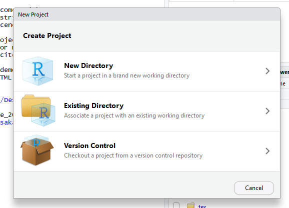
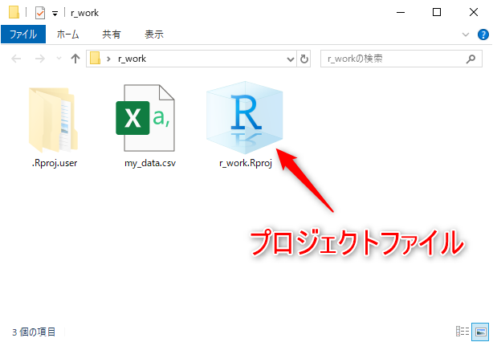

# パス

## ファイルを扱うために必要不可欠な知識

データ分析の対象となる多くのデータは、**CSVファイル**と呼ばれる形式のファイルとして配布されています。
そして、RStudioでデータ分析を行うためには、必ず、
このCSVファイルのような分析の対象となるデータをもっている**ファイルをRに読み込む**必要があります。
また、Rを使ったより複雑な処理を行う時、その処理をファイルに記述して保存します。
これら保存された処理は、他の処理からそのファイルを読み込むことで利用したりします。
このように、Rの処理を行う場合に、ファイルを扱う作業は必須となります。

ここで、普段使っているWindowsの環境では、何かのファイルを指定する時、
画面を見て目の前にあるファイルのアイコンにマウスカーソルを持って行き、
それをクリックするだけで済みます。
もしくは、何かのアプリのメニューからファイル選択用のダイアログを呼び出し、それを使ってファイルを選択します。
しかし、コンソール上での作業では、アイコンやメニューやダイアログはありません。
ファイルの指定もコマンドとして文字を書く事でその作業を行っていきます。
この時、パソコン上にあるファイルを特定するために必要となるのが**パス**です。

## Windowsのディレクトリ構成

Windows上のファイルは、**ドライブ**の中にある**ディレクトリ**の中、若しくは、ディレクトリの中のディレクトリ（又は、そのディレクトリの中のディレクトリの中の、、、、）に存在しています。
尚、ディレクトリはWindowsではフォルダと呼ばれることもあります。
普段、デスクトップや自分のドキュメントフォルダ等へ
データを保存していると思いますが、これらの場所も全て、ドライブから始まるディレクトリ構造の一部になっています。

Windowsのエクスプローラーを使って実際に見てみましょう。
PCの中にあるCドライブをエクスプローラーで開いて下さい。（図\@ref(fig:directorytree001)）

```{r directorytree001, echo=FALSE, out.width="90%", fig.cap="Cドライブのルートディレクトリ"}
knitr::include_graphics("images/folder_c001.png")
```

もちろん各人によって内容は異なりますが、最低限、次の様なフォルダが見られるはずです。

- Windows
- Program Files
- Users、若しくは、ユーザー

**`Windows`**フォルダは、Windows自体の色々なファイルやフォルダが入っています。
また、**`Program Files`**フォルダの中には、
あなたのWindowsにインストールされているプログラムの実行ファイル等が入ったフォルダが入っています。
そして、**ユーザー**フォルダの中には、
各アカウント名のフォルダが在り、その中を覗くと
自分がいつもデータを整理しているであろう見慣れたフォルダ名が並んでいると思います。

少し探索してどんなフォルダの中にどんなフォルダが入っているのか、
Cドライブからどんな順番であなたのデスクトップやドキュメントフォルダが
位置しているのか、Windowsのディレクトリ構造の大雑把なイメージを持って下さい。

## パスの書き方のルール

エクスプローラーでディレクトリ構造の探索を行ってみると、
例えば私（アカウント名shunsk）のデスクトップにあるsample.txtというファイルは、「Cドライブの中のユーザーディレクトリの中のshunskディレクトリの中のデスクトップディレクトリの中のsample.txt」という風に一意に言葉で説明することができることが分かります。そして、これを次のルールに基づいて表現することで、コンソール上で利用できるファイルパスになります。

- 先頭をドライブ名（CとかDとか）＋コロンではじめる
- ディレクトリを表すためにディレクトリ名を"/"（スラッシュ）で区切る

私のデスクトップ上のsample.txtのファイルパスは次のようになります。

```
C:/Users/shunsk/Desktop/sample.txt
```

もう少し、別の例も見てみましょう。

|パス|説明|
|:---|:---|
|C:/Users/shunsk/ |CドライブのUsersディレクトリの中のshunskディレクトリ|
|C:/|Cドライブの直下のディレクトリ|
|D:/data/text/hoge.txt|Dドライブのdataディレクトリの中のtextディレクトリの中のhoge.txtファイル|

## Windowsのパスの注意点

ここで、WindowsのパスをRで扱う時の注意点を述べておきます。

### ディレクトリを表す記号

まず、Windowsのシステム上でのパス表記において、
ディレクトリを表す記号には**円マーク**、若しくは、
これと同じ文字を意味する**バックスラッシュ**が使われています。
しかし、Rの文字列においては、バックスラッシュは特別の意味を持つ文字であるため、
単独でバックスラッシュの文字を使うことが出来ません。
そこで、Rのコンソール上では、ディレクトリ区切りを表現するためには、
必ず、**スラッシュ記号**を使います。

### ディレクトリ名称

次に、Windowsのディレクトリ名は、エクスプローラーで表示されるものと、
ファイルシステム上の名称で異なるものがあります。
上記の例では、エクスプローラーで**ユーザー**や**デスクトップ**と
日本語で表示されていても、
システム上のディレクトリ名は、UsersやDesktopとなっている場合があります。
RStudioでパスを入力する時は、
補完機能が使えるので真のディレクトリ名をわざわざ調べる必要はありません。
補完候補の中には、真のディレクトリ名があるので、そこから選択すればよいだけです。

### 間違えがちな所

パスの初めは、ドライブ名＋コロンの後に**まずスラッシュが入ります**
また、コンソール上でのパスは文字列として扱うので、必ず、**引用符で囲みます**。

|正誤|パス|
|:---|:---|
|正解|"C:/Users/"|
|間違い|C:Users|

### パス入力の実習

では、デスクトップに`sample.txt`という空のファイルを作成し、
このファイルパスを`sample_txt_path`という変数に代入してください。
ファイルパスの入力には必ず、補完機能を使います。

ファイルパス補完のコツは、まず、ドライブのルートディレクトリとして
`"C:/"`と書き込み、そのスラッシュの後ろでタブキーを押すと
ディレクトリ構造に従った補完候補が呼び出せます。

```{r}
# ファイルパスを補完機能で入力
sample_txt_path <- "C:/Users/shunsk/Desktop/sample.txt"
```

## カレントディレクトリ

Windowsを使っている場合には、ほとんど意識することがありませんが、
実は、パソコンの操作をしている時、
操作をしている人は必ず**どこかの場所(ディレクトリ)にいる**ことになっています。
そして、その場所を**カレントディレクトリ**（current directory: 現在のディレクトリ）やワーキングディレクトリと呼びます。

実際に、あなたが今どこにいるのか？あなたのカレントディレクトリを調べてみましょう。
カレントディレクトリのパスを出力する`getwd()`関数を実行してください。

```{r}
# カレントディレクトリを出力するコマンド
getwd()
```


出力は、実行した人ごとに異なります。

さて、まずは、この「**カレントディレクトリ**」という単語を覚えて、
「自分のいるディレクトリ」という概念があるということを意識しましょう。
また、カレントディレクトリは、コンソール毎にあります。
複数のRのコンソールを立ち上げている時には、
そのコンソール毎にカレントディレクトリは独立しています。


### カレントディレクトリとパスの種類

さて、先に説明したパスの表現は以下の様なものでした。

`"C:/Users/shunsk/Desktop/sample.txt"`

このようにドライブ名から表示したパスの書式を**絶対パス、完全パス、フルパス**等と呼びます。

これに対して、カレントディレクトリからの相対的な位置で表したパスの書式を**相対パス**といいます。

例えば、カレントディレクトリ内の`csvdata`ディレクトリにある
`hoge.txt`というファイルなら、
相対パスでの表現の仕方は、`"csvdata/hoge.txt"`となります。

相対パスを表現する文字列の先頭には、
ドライブ名やディレクトリを意味するスラッシュがなく、
カレントディレクトリ直下にある
**ファイル名やディレクトリ名そのものから始まります**。

表現の仕方をあらためて次にまとめておきます。

絶対パスで`"C:/Users/shunsk/Desktop/sample.txt"`となっているファイルについてのカレントディレクトリと相対パスの関係は次の通りです。

|カレントディレクトリ|相対パス|
|:---|:---|
|"C:/Users/"|"shunsk/Desktop/sample.txt"|
|"C:/Users/shunsk/"|"Desktop/sample.txt"|
|"C:/Users/shunsk/Desktop/"|"sample.txt"|

## カレントディレクトリを意識した作業

みなさんも、普段、パソコンを使って何かの作成作業を行っていると思います。
その作業では、作業ごとにフォルダを作成し、
その中にワードファイルやエクセルファイル、
写真等のイメージファイル、その他のデータファイル等を入れて
管理しているのではないでしょうか？
そして、作業をする時はこれらファイルの入っている**フォルダを開き**、
その中にあるファイルアイコンをダブルクリック等して作業をしていることと思います。

Rをコンソールで使う場合でも同様です。
Rの作業をする時に必要となるファイルをフォルダに入れて管理することになります。
ただ、Rでの作業はコンソールで行うので、視覚的にフォルダを開きませんが、
代わりに、その**フォルダをカレントディレクトリに設定**して、
各ファイルへのアクセスを容易にします。

ここから、カレントディレクトリを意識して、
実際のRでの作業を始めるための準備を体験してもらいます。

### デスクトップでの事前準備

まず、デスクトップに**`r_work`**というフォルダを作って下さい。
次に、作業対象となるCSVファイルを用意します。
適切な整然データのcsvファイルの例として、次のwebページから国土交通省が発表している不動産取引価格情報データのCSVファイルを入手できます。適当なcsvファイルを入手してください。
（手元に適切なデータがある場合は、それを使っても結構です。）

[http://www.land.mlit.go.jp/webland/download.html](http://www.land.mlit.go.jp/webland/download.html)

準備したcsvファイルをr_workディレクトリの中にコピーし、
コピーしたファイル名は**`my_data.csv`というファイル名に変更**しておいてください。


### カレントディレクトリの変更

デスクトップ上での準備が完了したら、
RStudioのコンソールのカレントディレクトリを
今、作成した`r_work`フォルダに変更する作業を行います。

カレントディレクトリの変更は、`setwd()`関数を使います。
`setwd()`関数には、
カレントディレクトリにしたいディレクトリのパスの文字列を引数として渡して使います。
各自のデスクトップへのパスはアカウント名が異なるため下の例とは異なるので、コピーアンドペーストでは失敗します。
必ず、補完機能を使って各自のデスクトップ上の`r_work`ディレクトリへのパスを入力しましょう。

```{r eval=F}
# デスクトップのr_workディレクトリをカレントディレクトリにする。
setwd("c:/Users/shunsk/Desktop/r_work/")
```

### ファイルの読み込み作業

整然データとしてのcsvファイルを読み込む関数の一つに
`read.csv()`関数があります。
この関数は、読み込みたいファイルのファイルパスを引数として取ります。
さて、この引数として渡すファイルパスは、上記で勉強した通り、
絶対パスと相対パスの両方で書けます。

まず、相対パスでデータを読み込んでみましょう。
読み込んだデータを保持するために、`data_a`という変数に代入してください。

```{r eval=F}
# 相対パスを使ってファイルを読み込む
data_a <- read.csv("my_data.csv")
```

このように、カレントディレクトリを適切に設定すると
ファイル読み込みを指示するコマンドのタイピング量は減り、
作業が便利になるように思えます。

では、作業をする時には、いつでも相対パスで指示すればよいのでしょうか？


### 相対パスと絶対パス

相対パスを使うには、前述の通り前提条件が必要です。
上記の作業では、ファイルを読み込む前に、カレントディレクトリの変更を行い、
カレントディレクトリが`my_data.csv`を入れている`r_work`になっていることが
**確実な状態**です。

この様に、カレントディレクトリと対象となるファイルの
**相対的位置関係をきちんと把握できている**場合、
相対パスでファイルを正しく指定することが出来ます。
逆を言えば、カレントディレクトリが分からなければ、
相対パスでパスの指定をすることは出来ません。


次に、絶対パスでデータを読み込んでみましょう。
今度は、`data_b`という変数に代入します。

```{r eval=F}
# 絶対パスを使ってファイルを読み込む
data_b <- read.csv("c:/Users/shunsk/Desktop/r_work/my_data.csv")
```

絶対パスは、今使っているパソコン上のファイルの場所を一意に表しています。
ですから、カレントディレクトリが何処であったとしても、
正しくファイルの場所を指定することが出来ます。

上記の様にファイルの読み込み作業において、
絶対パスと相対パスの両方のコードで実践してみました。
この両パス表記は、どちらかが優れているというものではなく、
それぞれ、その性質に応じた使い方をします。
そして、どちらの表記であっても、
自分で読み書きできる必要があります。

まず、絶対パスを使う時は、
現在のカレントディレクトリを気にせず、
ダイレクトにパスを指定したい場合です。
例えば、カレントディレクトリのすぐ近くのディレクトリに
カレントディレクトリを移動させたい場合には、
相対的な関係を直感的に把握できますが、
構造的に離れたディレクトリへ移動する時には、
ディレクトリルートから辿る方が簡単です。

次に、絶対パスが使えない場合があることを把握しましょう。
それは、絶対パスの入ったコードは他人の環境で動かないという事です。
前述しましたが、私のデスクトップ上のファイルへの絶対パスは、
あなたのデスクトップ上のファイルへの絶対パスになりません。
ですから、絶対パスを使ったコードを
あなたがコピー＆ペーストして実行してもうまく動きません。

一方、他人とコードを共有する場合、
若しくは、自分のパソコンの中であっても、
そのコードの置き場所を何処にでも移動できるようにする場合、
パス表記全てをベースとなるディレクトリからの相対表記にしておき、
作業の時に、カレントディレクトリをそのベースディレクトリに設定することで、
ベースディレクトリの絶対パスが何処であっても、相対パスの表記は文字通り同じになります。
つまり、あなたが、適切なカレントディレクトリさえ設定すれば、
私の相対パスで書かれたコードをコピー＆ペーストするだけで、
あなたのパソコンでもそのコードが動くようになります。

以上のパスに関する基礎的な知識を把握していれば、
Rの教科書でのファイルの読み込み作業で失敗することは無くなります。


## RStduioのプロジェクト

先ほどは、コマンドを使ってカレントディレクトリを変更することを覚えましたが、
Rで作業をする毎にわざわざカレントディレクトリを設定するのは面倒です。
そこで、RStudioは、このような煩雑な作業をしなくてすむように、
**プロジェクト**という機能を備えています。

RStudioでは、作業ディレクトリ毎にRStudioのプロジェクトファイルを作成しておきます。
そうすることで、そのプロジェクトファイルを開くだけで、
そのディレクトリがカレントディレクトリであるコンソールが開くようになります。
また、別のプロジェクトファイルを開くと、
その別の作業用のディレクトリをカレントディレクトリとする別のコンソールが開きます。
このように、RStudioでは、作業ディレクトリ毎のコンソールを別々に開いて複数の作業を同時に行う事が簡単にできます。

### プロジェクトの作成

では、早速プロジェクトを作成しましょう。
RStudioを立ち上げ、メニューのFileからNew Projectを選択します。[^3]
そうすると、プロジェクト作成ダイアログが表示されます。（図\@ref(fig:project001)）

[^3]: 既にコンソールで何かの作業をしていると、作業中の変数等の状況を保存しておくかどうかの確認ダイアログが出ますが、
特に必要が無い限り作業は保存しませんので、`Don't Save`ボタンをクリックすればＯＫです。


```{r project001, echo=FALSE, out.width="70%", fig.cap="プロジェクト作成ダイアログ"}

```


ここでは、選択肢が３つありますが、
今回は、一番手軽にプロジェクトを作成できる２番目の方法
「既に存在する作業フォルダをプロジェクトにする(Existing Directory)」を
紹介します。
この２番の方法さえ覚えておけば、新規にフォルダを作ってプロジェクトにする時も、
自分で新しいフォルダを先に作りさえすれば、この２番の方法を使って同じようにプロジェクトを作成することが出来ます。

では、ダイアログの`Existing Directory`の部分をクリックして下さい。
ダイアログが切り替わるので、ディレクトリ選択ダイアログ（Browseボタンから）等を使って、
プロジェクトにしたい既存のディレクトリのパスを指定します。
ここでは、先に作成したデスクトップ上にある`r_work`のパスを指定して下さい。
パスの指定が出来たら、
ダイアログ右下の`Create Project`ボタンをクリックすると
プロジェクトの作成作業は完了です。
そのまま、デスクトップの`r_work`ディレクトリを
カレントディレクトリとしたRStudioのコンソールが開きますが、
ここで、一旦、RStudioを終了しましょう。
右上の×ボタン等を使って終了して下さい。

さて、今までRStudioの起動は、Windowsのスタートメニューから行っていたと思います。
しかし、これからの作業はRStudioのプロジェクトファイルから起動することが出来ます。
デスクトップの`r_work`フォルダを開いて下さい。
ファイル名の拡張子が`.Rproj`となっていて、
Rの文字がついたアイコンのファイルが新たに作られているはずです。
これが、RStudioのプロジェクトファイルです。（図\@ref(fig:project002)）

```{r project002, echo=FALSE, out.width="70%", fig.cap="プロジェクトファイル"}

```

このディレクトリでの作業を開始する時には、
このプロジェクトファイルをダブルクリックする事で、
そのディレクトリをカレントディレクトリとしたコンソールを持つ
RStudioを起動することが出来ます。

### RStudioに小さく表示される情報

RStudioはプロジェクトごとに立ち上げることが出来ると述べましたが、
複数のRStuidoが立ち上がると、
どのRStudioがどのプロジェクトが見わけがつかなくなるかもしれません。

そんな時、右上ペインのその右上をよく見てください。
その他、カレントディレクトリを知るために`getwd()`関数を使っていましたが、
コンソールの上部、Consoleとタブに書かれているところのすぐ下をよく見てください。
RStudioには、小さなところにいろんな情報が隠れています。


