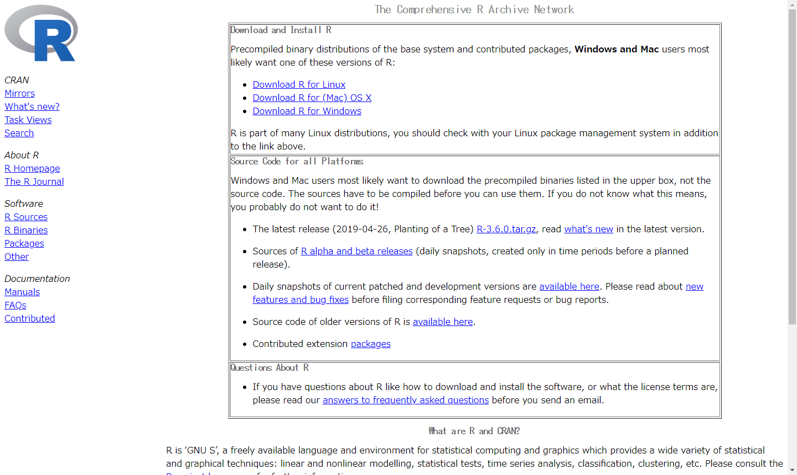
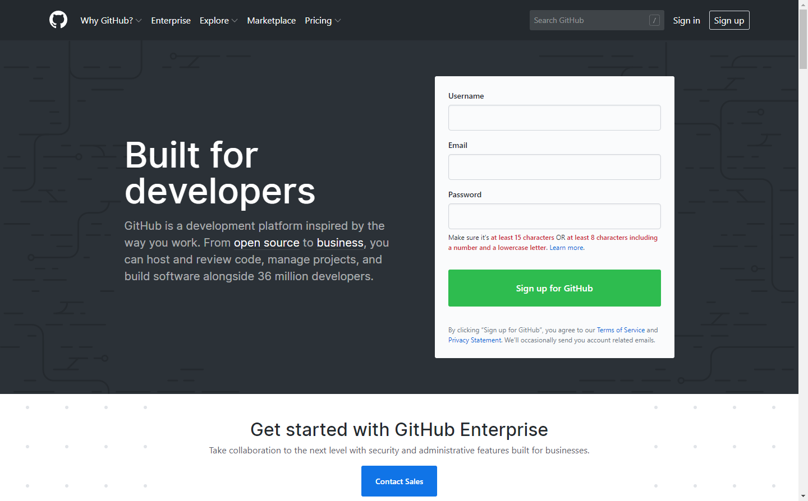
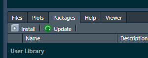
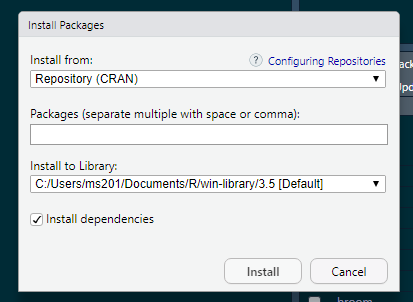

# パッケージ

Rの**パッケージ**とは、関数やデータセットを集めたものです。
Rでは、パッケージをインストールすることで、 
機能を拡張することが出来る仕組みになっています。
Rの参考書等ではよく、
その説明の中で使われる関数を含んでいるパッケージのインストールが要求されます。

このパッケージは、世界各国の現場の研究者達や
RStudioチームをはじめとするオープンソース開発者達が
独自に開発して公開しています。
このパッケージには、**CRAN**を通じて公式に配布されているものと、
**GitHub**等を通じてプログラマが独自に配布しているものとがあります。

まず、CRANは、The Comprehensive R Archive Network（包括的Rアーカイブネットワーク）の略称で
Rに関するコードとドキュメントを配布しているサーバー群です。（図\@ref(fig:cranss001)）Rの本体もこのCRANで配布されています。
CRANは、シーランやクランと発音されているようです。
CRANは世界各国にミラーサーバーがあり、それらが常に同期されています。

```{r cranss001, echo=FALSE, out.width="90%", fig.cap="https://cran.r-project.org/"}

```


次に、GitHubは、
世界中のプログラマが沢山のプログラムのソースコードを公開している有名なWebサービスです。（図\@ref(fig:githubss001)）
プログラムの開発をサポートするサービスなので、
CRANに登録されているRのパッケージも、
その開発段階の最新のものはGitHub上にもあったりします。


```{r githubss001, echo=FALSE, out.width="90%", fig.cap="https://github.com/"}

```

CRANに登録されているパッケージは、2019/5/31時点で14,307あります。
しかし、RのパッケージはCRANに登録されずにGitHub上のみで
公開されているものもあるので、世の中にあるRパッケージは上記の数よりもずっと多く存在します。
Rでは、これらの全てのパッケージをインストールしなければならないわけでは無く、
これらのうちから自分の作業に必要なもののみをインストールします。
一般的に、Rで新しいことをはじめようとする場合、
参考書等でほぼ初めに述べられるのが、
その作業に必要となるパッケージのインストールについてです。
また、Rのバージョンアップを行ったり、再インストールを行った場合には、 
いつも使っていたパッケージについて、再度インストールする必要が生じます。  
以上のことから、R言語を利用する場合、パッケージの管理は必須の作業になります。  


## RStudioでのパッケージのインストール

Rには、パッケージをインストールするための**Rの関数**が用意されています。
ここで注意が必要なのは、
上記の通りRのパッケージの配布先は主にCRANとGitHubの２つがありますが、
このCRANにあるパッケージとGitHubにあるパッケージで
**インストールするための関数が異なります。**

|ダウンロード先|インストール用関数|
|:---:|:---:|
|CRAN|install.packages()|
|GitHub|install_github()|

このように、Rには本来的にインストール用の関数が用意されていますが、
日常のR作業においては、**RStudioの機能を使ってパッケージの管理を行う**方が便利です。
RStudioの**右下ペイン、Packagesタブ**を見てください。（図\@ref(fig:packagetab001)）

```{r packagetab001, echo=FALSE, out.width="70%", fig.cap="RStudio右下ペインのPackagesタブ"}
knitr::include_graphics("images/packagetab001.png")
```

一覧には、既にインストールされているパッケージの
パッケージ名、概略の説明、バージョンが順に記されています。
このタブからパッケージに関する色々な操作が出来ますが、まずは、
パッケージのインストールの仕方を覚えましょう。
但し、この方法でインストールできるのは、CRANで配布されているパッケージのみです。
また、パッケージのインストールは、
RStudio内部で自動的にCRAN等からパッケージをダウンロードしてからインストールを行うため
インターネットに接続された状態で行う必要があります。


Packagesタブのタブの下をよく見ると、InstallとUpdateと書かれた部分がみつかります。（図\@ref(fig:packagetab002)）
```{r packagetab002, echo=FALSE, out.width="70%", fig.cap="RStudio右下ペインのPackagesタブ"}

```


このうち**Install**と書かれている部分をクリックしてください。
**Install Packagesダイアログ**が出てきます。（図\@ref(fig:installpackagesdai001)）


```{r installpackagesdai001, echo=FALSE, out.width="70%", fig.cap="Install Packages ダイアログ"}

```

このダイアログの Pacakges(separate multiple with space or comma): 
と書かれている入力フォームにインストールしたいパッケージ名を入力し
ダイアログ下部のInstallボタンを押すことでパッケージのインストールが出来ます。

このRStudioでのインストール機能については、
まず、この入力フォームでは、パッケージ名の補完機能が働いています。
パッケージ名の綴りがうろ覚えであっても、補完メニューが支援してくれるので便利です。
次に、入力フォームには、スペースもしくはカンマ区切りを使うことで、
複数のパッケージ名を書き込んで、一度に複数のパッケージをインストールすることが出来ます。
更に、ダイアログの下部にあるInstall dependenciesと書かれている部分にある
チェックボックスにチェックがあることを確認しましょう。
パッケージは、それをインストールするためには、
先に別のパッケージをインストールしておく必要がある場合があります。
（こういう関係は、依存関係と呼ばれる）
Install depencdenciesのチェックを入れておけば、
自分がインストールしたいパッケージに必要なパッケージがある場合、
依存関係が解決されるように自動的に他のパッケージをインストールしてくれます。

尚、RStudioのインストール機能を使っても
実際には、先に説明したパッケージのインストール関数が使われて作業が行われいます。
Install PackagesダイアログのInstall ボタンを押すと、
左側ペインのConsoleに沢山の出力が現れているはずです。
先に述べた通り、インストール作業では、自分の指定したパッケージ以外にも
依存関係を解決するために沢山のパッケージがインストールされる事があり、
この場合、インストール作業が終了するまで数分かかることもあります。
インストール作業中なのか、終了したのかは、
Consoleにプロンプトがあるかないかで判断できます。
Console画面をよく見て、作業が終了するのをのんびり待ってください。

また、パッケージのインストール作業は、
ネットワーク回線の状態が悪い時などパッケージのダウンロードに失敗して、
インストール作業自体が失敗することがあります。
「インストールしたはずなのに、、」という場合、
Packagesタブの一覧に、パッケージ名があるかどうか確認してください。
Packagesタブ上部右端の検索フォームを使うと簡単です。
よくわからない場合、再度重複してインストールしたとしても問題有りません。
もう一度、目的のパッケージをインストールしてみてください。


## パッケージの管理

再度、右下メインのPackagesタブに着目してください。（図\@ref(fig:packagetab001)）
このパッケージタブでは、インストールだけでなくパッケージについて様々なことが出来ます。

### アップデート

一覧上部にある、Updateと書かれている部分をクリックすると、Update Packagesダイアログが出てきます。
アップデート可能なパッケージがある場合、ここに表示されるので、アップデートするパッケージにチェックをいれて
Install Updateボタンをクリックすれば、アップデートをおこなってくれます。

### マニュアルをみる

パッケージ一覧のパッケージ名をクリックすることで、右下ペインはHelpタブに切り替わり、
クリックしたパッケージのマニュアルを表示することが出来ます。

### パッケージの読み込みとデタッチ

一覧の左端にあるチェックボックスにチェックをいれると、Colnsoleの環境にそのパッケージをロードします。
Consoleに目を移すと、`library()`関数が呼ばれていることがわかります。
逆に、チェックを外すと、現在のConsole環境からそのパッケージを取り除きます。
これもConsoleに目を移すと`detach()`関数が呼ばれていることを確認できます。

### パッケージに関するWebサイトをみる

一覧の右端に小さな丸いアイコンが二つ並んでいます。
そのうち、左側の十字マークのアイコンをクリックすると、
Webブラウザが起動し、そのパッケージの開発元のGitHubのリポジトリページやCRANのWebページなどを閲覧することが出来ます。

### パッケージアンインストール

一覧の右端に小さな丸いアイコンが二つ並んっでいるうちの、
右側の×マークのアイコンから
パッケージをアンインストールすることが出来ます。
×マークアイコンをクリックすると、
そのパッケージをアンインストールして良いかの確認ダイアログが出ます。
アンインストールする場合は、Yesを選択してアンインストールを実行します。
但し、基本的でシステムに必須のパッケージは、ここからアンインストールしても
アンインストールが出来ない旨が表示されて、アンインストールは行われません。


## パッケージを読み込むlibrary()関数

パッケージのに含まれている関数は、パッケージをインストールしただけでは使えません。
ここで、GitHubで公開されているパッケージをインストールするための関数ｃと、
この関数を含むdevtoolsパッケージの関係を例にパッケージの使い方を紹介します。

通常、利用したい関数を含んだパッケージを、上記の手順でRにインストールします。
既存パッケージを確認して、devtoolsパッケージがインストールされていない場合、
ここでインストールしてみてください。

そして、パッケージ内の関数を利用する場合、まず、その環境（console等）に、`library()`関数を使って
パッケージを読み込みます。

```{r}
# devtoolsパッケージを読み込む
library(devtools)
```

この様にパッケージを読み込むことで、
このパッケージに含まれる`install_github()`関数がこのコンソール上で使えるようになります。

パッケージのインストールをちゃんと行っていても、
`library()`関数によるパッケージの読み込みを忘れていると
そのパッケージに含まれる関数を呼び出しても、
その関数を見つけることが出来ない旨のメッセージが添えられたエラーが起こります。
忘れずにパッケージの読み込みをしましょう。


## GitHubにあるパッケージのインストール

先に紹介した通り、GitHubで公開されているパッケージは、`install_github()`関数を使ってインストールします。
そして、この関数を利用するためには、devtoolsパッケージをインストールした上で、
`library()`関数を使ってパッケージをコンソールに読み込んで置くことを忘れてはいけません。


`install_github()`関数に渡す引数は、インストールしたいパッケージのあるgtihub上のリポジトリを表す文字列です。

GitHubには、沢山の開発者のアカウントがあり、そのアカウントの中に複数のリポジトリが入っています。
リポジトリとは貯蔵庫という意味ですが、単純に開発している物毎にまとめられたディレクトリと考えればＯＫです。


ここでは、GitHub上のパッケージの例として**reti**パッケージを例としてインストールします。
[reti(Real Estate Transaction-price Infomation data)パッケージ](https://github.com/rea-osaka/reti)[^4]は、
国土交通省が公開している不動産取引価格情報のデータを Rで扱いやすくするためのパッケージで、
筆者の所属する[大阪府不動産鑑定士協会不動産取引価格情報活用小委員会](https://rea-osaka.github.io/)[^5]が
GitHub上で開発して公開しています。

[^4]:https://github.com/rea-osaka/reti
[^5]:https://rea-osaka.github.io/

このパッケージあるリポジトリをGitHubのURLで表すと次の通りになっています。

```
https://github.com/rea-osaka/reti
```

`https://github.com/`の後ろにある`rea-osaka`の部分がアカウント名で、
スラッシュを挟んで、その次の`reti`の部分がリポジトリ名です。

リポジトリは各アカウントの人たちが自由に付けたり、
他人の物をコピーして持ってきたり出来るのでリポジトリ名はGitHub全体では重複することが出来ます。
但し、各アカウント内では同名のリポジトリは存在することが出来ません。
そして、GitHub上では、アカウント名は重複しません。
そこで、GitHub上でのリポジトリは、`アカウント名/リポジトリ名`という形式を使って一意に選択することが出来ます。
rea-osakaが開発しているretiは、**`rea-osaka/reti`**と表記することが出来ます。

そして、`install_github()`関数には、このリポジトリを特定する文字列を引数として渡します。

```{r eval=FALSE}
# GitHubじょうのretiパッケージをインストールする
library(devtools)
install_github("rea-osaka/reti")
```

GitHub上で公開されているパッケージ等は、
GitHubのリポジトリページをみると大体英語で書かれていますが、**Install**という項目があります。
そこには、上記で述べた通り、devtoolsパッケージをインストールしていないなら、
先にインストールして下さいということや、それを実際に行ってくれるコードが書かれています。
そして、そのパッケージをインストールするための`install_github()`関数のコードも書かれています。
そこで、注意深い人は、次のような表示になっていることに気づくと思います。
例えば、retiのページでは次のようなコードが書かれています。

```{r eval=FALSE}
devtools::install_github("rea-osaka/reti")
```

`install_gitHub`の前に`devtools::`が付いています。
この表記を使うと、
関数名が一意に決定できるため`library()`関数でパッケージを読み込む必要がありません。

実は、関数名は、パッケージ間では、重複する可能性があります。
そこで、どの関数を使っているのかをはっきりさせるためには、どのパッケージのどの関数という長い表記になります。
しかし、実際のプログラム上では、イチイチ長い名前を書くのは見づらくなるので、
`library()`関数を使ってこの環境で同名の関数が複数あるのにパッケージ名が省略されている場合は、
`library()`で指定したものを使うという仕組みが作られています。
逆に、正式な関数の名称は、パッケージ名と関数名を`::`で繋いで表すことが出来、
その具体例が上記の`devtools::install_github()`という表記なのです。

このような理解があれば、安心してgithub上のパッケージのインストールにも挑戦できると思います。


## 有名なパッケージ

### tidyverse

[tidyverse](https://www.tidyverse.org/)[^6]にはデータサイエンス作業で必須となるパッケージ群です。

実は、tidyverseはパッケージではなく、パッケージの集まりですが、
インストール作業や`library()`関数での読み込みは、
通常のパッケージと同じく`tidyverse`でＯＫです。
このパッケージ群は、CRANで配布されているので、RStudioのPackagesタブからインストールできます。
更に、CRANで配布されているものよりも最新の開発版については、
各パッケージについてGitHubでも公開されており、これを`install_github()`関数を使って
インストールすることも出来ます。

[^6]:https://www.tidyverse.org/

tidyverseにはデータサイエンス作業で必須となる以下のパッケージが含まれています。

#### ggplot2{-}
グラフの描画を行うための関数をあつめたパッケージ

#### dplyr{-}
整然データに対して、フィルタリングしたり、並べ替えをしたり、列を抜き出したり、新たな列を作ったり、
要約計算をしたりするための関数が集まったパッケージ。
ディープライヤーと読めばＯＫ。プライヤーはペンチです。

#### tidyr{-}
tidyはきちんとしたという意味の英語ですが、データサイエンス上では**整然データ**を差します。
そして、tidyrは一般データを扱いやすい整然データに加工するための関数があつまったパッケージです。
タイディアーと読みめばＯＫです。

#### readr{-}
R外部にあるデータファイルをRに読み込むための関数が集まったパッケージです。

#### purrr{-}
関数型プログラミングを行うための関数セットです。

#### tibble{-}
data.frame型のデータを改良したデータ型を使うための関数が集まったパッケージです。

#### stringr{-}
文字列処理を行うための関数が集まったパッケージです。

#### forcats{-}
ファクタ型のデータを扱う際の一般的な問題を解決してくれる関数が集まったパッケージです。


### devtools

[devtools](https://devtools.r-lib.org/)[^7]は、パッケージ開発を支援するための関数を集めたパッケージです。
先に紹介した通り、GitHubからのパッケージのインストールには、このパッケージのインストールは必須です。
CRANで配布されていると共に、GitHub上でも開発版が公開されています。

[^7]:https://devtools.r-lib.org/

### leaflet

[Leaflet](https://rstudio.github.io/leaflet/)[^8]という、対話的地図環境を構築するためのjavascriptライブラリをRから使うための関数を集めたパッケージです。
これを使うことで、データをオープンストリートマップ等の上に簡単にプロットできるようになります。
CRANで配布されていると共に、GitHub上でも開発版が公開されています。

[^8]:https://rstudio.github.io/leaflet/


