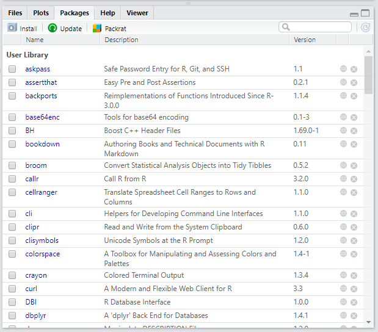

# パッケージ

Rの**パッケージ**とは、関数やデータセットを集めたものです。
Rでは、パッケージをインストールすることで、 
機能を拡張することが出来る仕組みになっています。
Rの参考書等ではよく、
その説明の中で使われる関数を含んでいるパッケージのインストールが要求されます。

このパッケージは、世界各国の現場の研究者達や
RStudioチームをはじめとするオープンソース開発者達が
独自に開発して公開しています。
このパッケージには、**CRAN**を通じて公式に配布されているものと、
**GitHub**等を通じてプログラマが独自に配布しているものとがあります。

まず、CRANは、The Comprehensive R Archive Network（包括的Rアーカイブネットワーク）の略称で
Rに関するコードとドキュメントを配布しているサーバー群です。（図\@ref(fig:cranss001)）Rの本体もこのCRANで配布されています。
CRANは、シーランやクランと発音されているようです。
CRANは世界各国にミラーサーバーがあり、それらが常に同期されています。

```{r cranss001, echo=FALSE, out.width="90%", fig.cap="https://cran.r-project.org/"}
knitr::include_graphics("images/cran_ss001.png")
```


次に、GitHubは、
世界中のプログラマが沢山のプログラムのソースコードを公開している有名なWebサービスです。（図\@ref(fig:githubss001)）
プログラムの開発をサポートするサービスなので、
CRANに登録されているRのパッケージも、
その開発段階の最新のものはGitHub上にもあったりします。


```{r githubss001, echo=FALSE, out.width="90%", fig.cap="https://github.com/"}
knitr::include_graphics("images/github_ss001.png")
```

CRANに登録されているパッケージは、2019/5/31時点で14,307あります。
しかし、RのパッケージはCRANに登録されずにGitHub上のみで
公開されているものもあるので、世の中にあるRパッケージは上記の数よりもずっと多く存在します。
Rでは、これらの全てのパッケージをインストールしなければならないわけでは無く、
これらのうちから自分の作業に必要なもののみをインストールします。
一般的に、Rで新しいことをはじめようとする場合、
参考書等でほぼ初めに述べられるのが、
その作業に必要となるパッケージのインストールについてです。
また、Rのバージョンアップを行ったり、再インストールを行った場合には、 
いつも使っていたパッケージについて、再度インストールする必要が生じます。  
以上のことから、R言語を利用する場合、パッケージの管理は必須の作業になります。  


## RStudioでのパッケージのインストール

Rには、パッケージをインストールするための**Rの関数**が用意されています。
ここで注意が必要なのは、
上記の通りRのパッケージの配布先は主にCRANとGitHubの２つがありますが、
このCRANにあるパッケージとGitHubにあるパッケージで
**インストールするための関数が異なります。**

|ダウンロード先|インストール用関数|
|:---:|:---:|
|CRAN|install.packages()|
|GitHub|install_github()|

このように、Rには本来的にインストール用の関数が用意されていますが、
日常のR作業においては、**RStudioの機能を使ってパッケージの管理を行う**方が便利です。
RStudioの**右下ペイン、Packagesタブ**を見てください。（図\@ref(fig:packagetab001)）

```{r packagetab001, echo=FALSE, out.width="70%", fig.cap="RStudio右下ペインのPackagesタブ"}

```

一覧には、既にインストールされているパッケージの
パッケージ名、概略の説明、バージョンが順に記されています。
このタブからパッケージに関する色々な操作が出来ますが、まずは、
パッケージのインストールの仕方を覚えましょう。
但し、この方法でインストールできるのは、CRANで配布されているパッケージのみです。
また、パッケージのインストールは、
RStudio内部で自動的にCRAN等からパッケージをダウンロードしてからインストールを行うため
インターネットに接続された状態で行う必要があります。


Packagesタブのタブの下をよく見ると、InstallとUpdateと書かれた部分がみつかります。（図\@ref(fig:packagetab002)）
```{r packagetab002, echo=FALSE, out.width="70%", fig.cap="RStudio右下ペインのPackagesタブ"}
knitr::include_graphics("images/packagetab002.png")
```


このうち**Install**と書かれている部分をクリックしてください。
**Install Packagesダイアログ**が出てきます。（図\@ref(fig:installpackagesdai001)）


```{r installpackagesdai001, echo=FALSE, out.width="70%", fig.cap="Install Packages ダイアログ"}
knitr::include_graphics("images/installpackagesdia001.png")
```

このダイアログの Pacakges(separate multiple with space or comma): 
と書かれている入力フォームにインストールしたいパッケージ名を入力し
ダイアログ下部のInstallボタンを押すことでパッケージのインストールが出来ます。

このRStudioでのインストール機能については、
まず、この入力フォームでは、パッケージ名の補完機能が働いています。
パッケージ名の綴りがうろ覚えであっても、補完メニューが支援してくれるので便利です。
次に、入力フォームには、スペースもしくはカンマ区切りを使うことで、
複数のパッケージ名を書き込んで、一度に複数のパッケージをインストールすることが出来ます。
更に、ダイアログの下部にあるInstall dependenciesと書かれている部分にある
チェックボックスにチェックがあることを確認しましょう。
パッケージは、それをインストールするためには、
先に別のパッケージをインストールしておく必要がある場合があります。
（こういう関係は、依存関係と呼ばれる）
Install depencdenciesのチェックを入れておけば、
自分がインストールしたいパッケージに必要なパッケージがある場合、
依存関係が解決されるように自動的に他のパッケージをインストールしてくれます。

尚、RStudioのインストール機能を使っても
実際には、先に説明したパッケージのインストール関数が使われて作業が行われいます。
Install PackagesダイアログのInstall ボタンを押すと、
左側ペインのConsoleに沢山の出力が現れているはずです。
先に述べた通り、インストール作業では、自分の指定したパッケージ以外にも
依存関係を解決するために沢山のパッケージがインストールされる事があり、
この場合、インストール作業が終了するまで数分かかることもあります。
インストール作業中なのか、終了したのかは、
Consoleにプロンプトがあるかないかで判断できます。
Console画面をよく見て、作業が終了するのをのんびり待ってください。

また、パッケージのインストール作業は、
ネットワーク回線の状態が悪い時などパッケージのダウンロードに失敗して、
インストール作業自体が失敗することがあります。
「インストールしたはずなのに、、」という場合、
Packagesタブの一覧に、パッケージ名があるかどうか確認してください。
Packagesタブ上部右端の検索フォームを使うと簡単です。
よくわからない場合、再度重複してインストールしたとしても問題有りません。
もう一度、目的のパッケージをインストールしてみてください。


### CRANからのインストール用関数{-}

CRANにあるパッケージは、`install.packages()`関数を
使ってインストールすることが出来ます。
引数には、パッケージ名を文字列として渡します。

```{r eval=FALSE}
# tidyverseパッケージのインストール
install.packages("tidyverse")
```

### GitHubからのインストール用関数{-}

GitHubにあるパッケージは、`install.packages()`関数を
使ってインストールすることが出来ます。
引数には、パッケージ名を文字列として渡します。


## 有名なパッケージ

## library()関数でパッケージを読み込む
