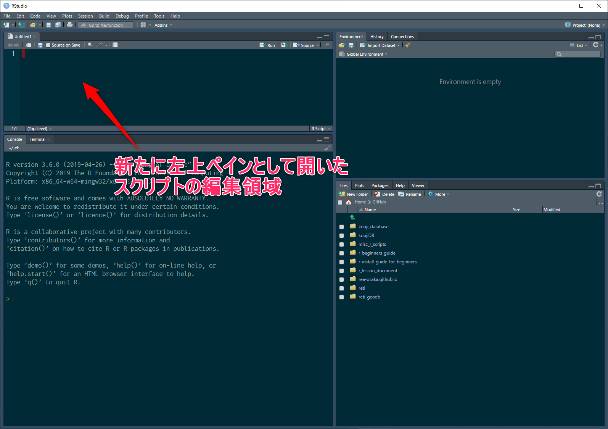

# スクリプト

RStudio上でのデータ分析作業の基本は、
コンソール上でコマンドを実行し、
その結果を見てさらに別のコマンドを実行するという作業を繰り返す
インタラクティブな作業です。

しかし、単純なコマンドを実行するだけでなく、
ggplot関数等、一つのコマンドが複数行に亘るような、
少し複雑なコマンドを入力する際には、
コンソール上での入力では不便を感じるようになります。
また、やがては、複数のコマンドを順に実行して、
その一連の処理によって目的を達成しようとするような、
いわゆる**プログラミング**作業を行う場合も出てくるでしょう。

このような場合、一般的なプログラム言語では、
コマンドをコンソールにプロンプトに直接キーボードから入力するのではなくて、
一旦、スクリプトファイルと呼ばれるファイルの中に、
コマンドを書き込んでおき、そのファイルをコンソールから呼び出して実行させます。
更に、RStudioの場合は、スクリプトファイルの一部分だけをコンソール上で実行させる機能もあります。


## スクリプトを作る

RStudioの一番上に並んでいるメニューから File > New File > R Script を選択します。
すると、左上ペインが開き、`Untitled1`と書かれたタブが作成されます。
この新しく作成された、
編集領域はWindowsのメモ帳のようなもので、
キーボードから自由に文字を書き込むことが出来ます。

```{r scriptpane001, echo=FALSE, out.width="90%", fig.cap="左上ペインのスクリプト編集領域"}

```

この編集領域は、まだファイルとして保存されていません。
保存は、タブ上部にあるフロッピーディスクアイコンをクリックして行えます。
始めて保存するときに、ファイル名を決定します。
そうすることで、タブ名がUntitledから決定したファイル名に変更されます。


## ノート


