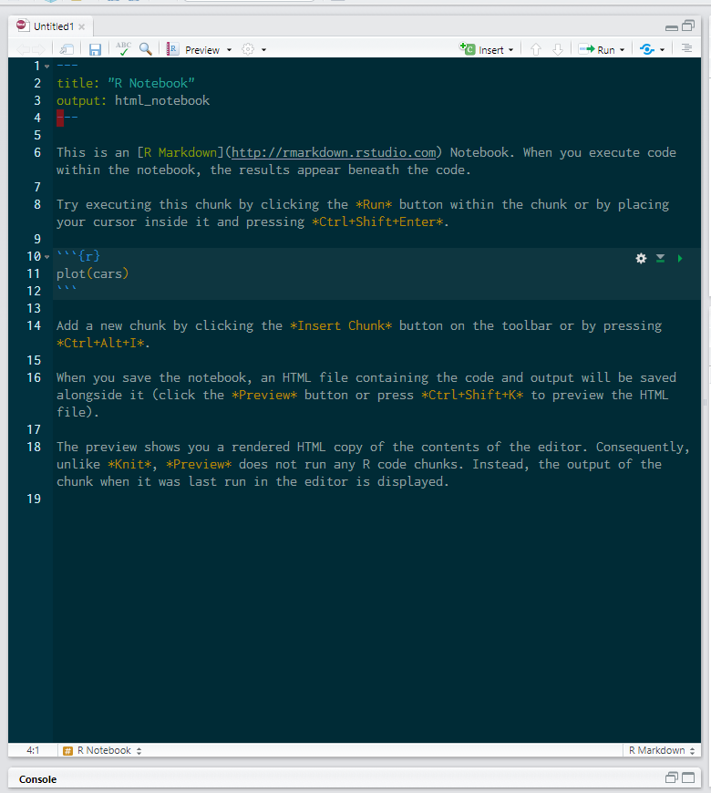
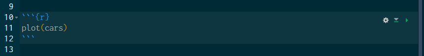
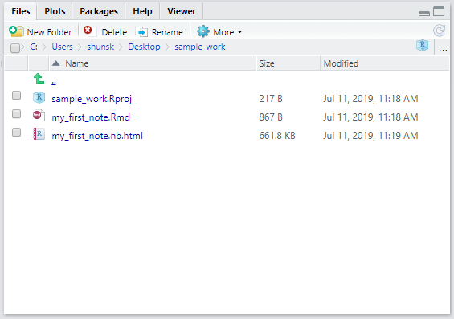
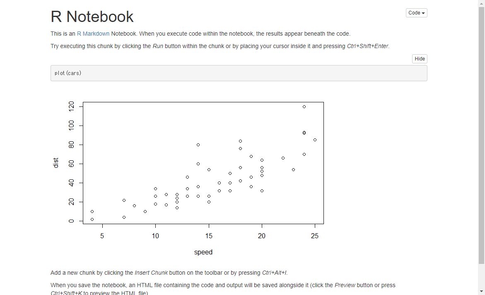
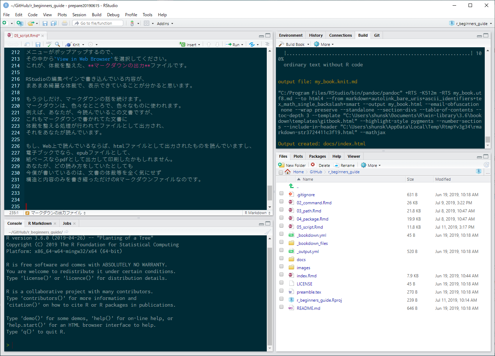
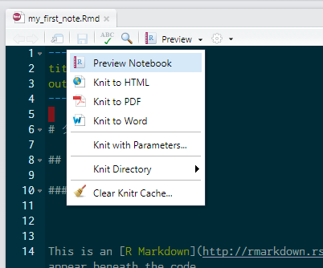

# 日常作業は、R Notebookで行う


実際のRによるデータ作業では、
その分析作業の流れ自体にも意味があり、
それらを一つ一つを形として残すことによって
作業の意味が分かり易くなります。

いままで、Rの作業はコンソールのプロンプトにコマンドを
入力し実行することで行うと説明してきました。
確かに、一つ一つのコマンド実行と、
その結果を見た上で、次のコマンドを何にするか決めて実行するという
インタラクティブな操作は行えます。
しかし、全体的な流れを俯瞰したり、
後からまとめて把握して検討したりというということには適していません。
また、全体をみて検討するだけならば、
一般的に、**スクリプト**を書く事によって、
複数コマンドを作業の流れの通りに記載し、
一気に実行する方法もありますが、この場合、
インタラクティブな操作ではありません。

そこで、Rの様にインタラクティブなデータ作業に適しているのが、**R Notebook** です。
この**ノート**というものを聞いたことが無い人がイメージするなら、
マイクロソフトのワードの文章を作っていて、
計算部分のみエクセルを埋め込んで実行できるようにしてあるという感じのものです。
また、その成果を保存したノートファイルは、RStudioやRの処理系が無くても
見ることのできるhtml形式のようなファイルなので便利に扱えます。


## 作業の準備はプロジェクトから

RStudioで作業する場合、作業用のフォルダを用意して、
そこにプロジェクトを作る癖を付けましょう。
ノート等を扱う場合、作業の成果をファイルとして保存することになりますし、
データ分析作業は、取り込み用のCSVファイルを管理する事も多く、
ファイル読み込み等、ファイル間の位置関係に気を配る必要が多くあります。
そこで、コード内ではファイルパスとして相対パスを使えるように、
関連するファイルを同じディレクトリ内で管理することが重要になります。

では、新しいフォルダを用意してプロジェクトを作り、
そのプロジェクトでRStudioを開いてください。

## R Notebookを新規作成する

RStudioのメニューから、File > New File > R Notebook と辿って選択して下さい。
RStudioの左側が一つのペインになったはずです。（図\@ref(fig:rnote001)）


```{r rnote001, echo=FALSE, out.width="80%", fig.cap="R Notebookを新規作成"}

```

但し、よく見ると、一番下にConsoleのペインが
小さく縮んでいるのが分かります。
各ペインの右上にある二つのアイコンを操作することによって、
各ペインは伸び縮させることができます。
ですから、コンソールが必要になったときは、それらアイコンを使ってConsoleペインを復元すればOKです。

この今、新しく開いたペインが R Notebook の編集領域です。
この部分はメモ帳と同じでカーソルを好きな所に動かして、
なんでも好きな事を書くことが出来ます。

英語がたくさん書かれていますが、
この殆どはプログラムのコードではありません。
内容は、R Notebook の簡単な使い方の説明ですが、
今は、特に気にしなくて結構です。
また、ここに書かれている文書は、**編集して消してしまっても、全然平気**です。
R Notebookを新規作成すれば、いつでも同じものが出てきます。

## R Notebookの構造

R Notebookの説明を理解するためには、まず最低限、
R Notebookの構造を覚えておかなければなりません。


### 設定を行うYAMLヘッダ

ファイルの先頭に注目してください。

```{r eval=FALSE}
---
title: "R Notebook"
output: html_notebook
---
```

R Notebookの先頭には必ず、この形式の表記があります。
この部分を**YAMLヘッダ**（YAMLはヤムルと読みます）と呼びます。
YAMLは、データ記述方法の一つで、
`---`に囲まれた部分に、あるルールに基づいてデータを記載する方法で、
R Notebook では、ここにそのノートのための設定を記載します。
しかし、R Notebook を触り始める時には、
この部分に何を書くのかを覚えるのではなく、
まず、ファイル先頭の`---`に囲まれた部分が、**YAMLヘッダ**であるということを
把握すれば十分です。

### コードが実行できる場所、チャンク

真ん中あたりに
```` ```{r}````と```` ``` ````に挟まれた部分があります。
このような部分を**チャンク**と呼びます。
チャンクはよく見ると、ほかの部分と少し色が変わっています。
また、右端に歯車、下三角、右三角の小さなアイコンがあります。（図\@ref(fig:chunk001)）


```{r chunk001, echo=FALSE, out.width="80%", fig.cap="チャンク"}

```

このチャンクにコマンドを書いて、右端の右三角アイコンをクリックすると、
チャンク内のコマンドが実行され、チャンクのすぐ下に結果が出力されます。
試しに、右三角アイコンをクリックしてみてください。carsデータに関する散布図が描画されます。

チャンクは、ノートの中に幾つでも作れます。
チャンクは、```` ```{r}````と```` ``` ````に挟まれた部分なので、
基本は、これを直接自分で書き込むことで作成できますが、
キーボードショートカット（Ctrl + Alt + I）や
ツールバーの**Insert**アイコンをクリックすると出てくるメニューから
**R**を選ぶことで
カーソル位置に空のチャンクを挿入できます。

### それ以外の部分

YAMLヘッダとチャンク以外の部分は、
メモ帳に字を書いているのと同じです。
この部分に、コードに関する説明や、
コードを実行した結果に対するコメントや考え等
文章ならなんでも書くことが出来ます。


## R Notebook と マークダウン

R Notebookを新規作成しただけの状態では、
編集ペインに表示されているだけで、実体のファイルがありません。
編集ペインのタブの部分を見てください。
新規作成されたR Notebookは、**Untitled1**となっているはずです。
この名称は、編集ペインの内容がまだ保存されていなくて、
ファイルの実態が無い事を表しています。

そこで、今から、編集ペインの内容を保存して、
ファイルの実態を作成しましょう。
ツールバーにある、フロッピーディスクのアイコンをクリック、若しくは、
キーボードショートカット（Ctrl + S）で、ファイルの保存が出来ます。
ファイル保存ダイアログが出るので、保存する場所が、
プロジェクトのディレクトリであることを確認して、
適当なファイル名、例えば、`my_first_note`と入力します。
この時、拡張子は付けなくて結構です。

ファイルを保存すると、
まず、タブの部分が Untitled1 から
保存したファイル名、
例えば **my_first_note.Rmd**等に変わっていることが確認できます。

RStudioの右下ペインをFilesタブに切り替えて下さい。
そこには、プロジェクトディレクトリ内に有るファイルの一覧が表示されていますが、
その中に、先ほど決定したファイル名に`.Rmd`という拡張子が付いたファイルと
`.nb.html`という拡張子が付いた拡張子が異なるけれどファイルが同じである２つのファイルをみつけることが出来ます。（図\@ref(fig:filetab001)）

```{r filetab001, echo=FALSE, out.width="80%", fig.cap="右下ペインFilesタブ"}

```

今、編集ペインで編集しているファイルは、`.Rmd`の拡張子が付いているファイルです。
今まで、「R Notebookを新規作成します」等という風に説明していましたが、
実は、この編集領域で書いてきた書式は、
**Ｒマークダウン**と呼ばれるルールに従って書かれている書式なのです。
そして、このRマークダウン形式で書かれているファイルには、
`.Rmd`という拡張子が付けられます。

### マークダウン

パソコンを使った文書作成を行う時、
真っ先にイメージするのは、
マイクロソフトのワード等に代表されるワープロソフトです。
これらのソフトは、文書作成時に、文章としての内容だけでなく、
印刷される時のイメージ、すなわち、文章の体裁、
例えば、文章が何処で折り返されるとか、ここの文字の大きさや太字にするかどうか等を
画面上で見た目通りに指定して、作製していきます。

しかし、実は、コンピューターを使った文書作成には、別の方法もあります。
その一つが**マークダウン**です。
マークダウンでの文書作成では、文書の内容と体裁を切り離して処理します。
まず、文書の内容については、タイトル、段落、文、
といった構造を意識して文書の内容を記述するだけです。
一方、体裁部分は、文書の意味的な内容は関知せず、
その構造等のみに基づいて体裁を決めて処理します。

こうすることで、まず、文書の内容を作成する時には、
デザインに気を使うことなく、
その文書の意味的内容の作成に集中が出来ます。
そして、体裁は、
特に気を使わなくても統一的な体裁を適用しやすくなると共に、
違う体裁に切り変えれば、文書全体の体裁を
一気に変更することが簡単に出来るようになります。


### マークダウンの出力ファイル

ここで、マークダウンという言葉が初耳の方にとっては、
あまりイメージできないと思いますので、実物を見てみましょう。
実は、文書の作成部分というのが、`.Rmd`ファイルの内容です。
そして、マークダウンについて体裁を処理したものが、`.nb.html`ファイルです。

このように、マークダウンを使った文書作成では、
まず、`.Rmd`ファイルに文書の中身を作製し、
これを処理して、体裁の整えられた**出力ファイル**が作製されます。
尚、RStudio上で、**R Notebook** を扱う場合、
出力について特別な事をする必要はなく、
単に、**`.Rmd`ファイルを保存するたびに`.nb.html`ファイルが自動で出力**されます。
(既にファイルがある場合上書きされて、保存された.Rmdに対応する最新のものになります)

出力されたファイルの拡張子が`.nb.html`で、htmlファイルの一種であることが分かります。
htmlファイルは、いわゆるインターネットで見ているページのもとになっている
html書式で書かれたファイルであり、この種類のファイルは、
インターネットエクスプローラー等のWebブラウザで開いて見ることが出来ます。
このRStudioの右下ペインFilesタブの中で、
`.nb.html`という拡張子がついたファイル名の部分をクリックすると、
メニューがポップアップするので、
その中から`View in Web Browser`を選択してください。
これが、体裁を整えた**マークダウンの出力**ファイルです。
（図\@ref(fig:nbhtmloutputfile001)）

```{r nbhtmloutputfile001, echo=FALSE, out.width="85%", fig.cap="R Notebook出力"}

```

RStudioの編集ペインで書き込んでいる内容が、
まあまあ綺麗な体裁で、表示できていることが分かると思います。

もう少しだけ、マークダウンの話を続けます。
マークダウンは、色々なところで、色々なものに使われます。
例えば、あなたが、今読んでいるこの文書ですが、
これもマークダウンで書かれてた文書に
体裁を整える処理が行われてファイルとして出力され、
それをあなたが読んでいます。

もし、Web上で読んでいるならば、htmlファイルとして出力されたものを読んでいますし、
電子ブックでなら、epubファイルとして、
紙ベースならpdfとして出力し、それを印刷したものかもしれません。
あなたが、どの読み方をしていたとしても
今僕が書いているのは、文書の体裁等を全く気にせず
構造と内容のみを書き綴っただけのRマークダウンファイルなのです。（図\@ref(fig:markdown001)）

```{r markdown001, echo=FALSE, out.width="95%", fig.cap="この文書の作成風景"}

```


### 出力形式の変更

markdownは、その処理によってさまざまな出力をすることが出来るというお話をしました。
そして、`R Notebook` も、そのmarkdownによるさまざまな出力のひとつなのです。
さて、では、さまざまな出力の中から、どうやって出力したい形式を選ぶのでしょうか？
実際には、色々な方法がありますが、`R Notebook`をRStudioで扱う場合には、
ファイル先頭のYAMLヘッダ内の、`output:`項目に`html_notebook`という値を与えます。
RStudioでは、この様に設定されているRmdファイルを読み込めば、
`R Notebook`で出力をしてくれます。

すなわち、この部分を他の値に書き換えると、別の形式で出力してくれるのです。

編集ペインのツールバーに
Rと書かれたノートの絵が描かれたアイコンと
その横には`Preview`と書かれている部分
（ここをクリックすると、R Notebookの出力のプレビューをしてくれます。）
がありますが、そのPreviewと書かれた文字の右隣に小さな下三角のアイコンがあります。
そこを、クリックするとメニューが現れます。（図\@ref(fig:selectmenuforoutput001)）

```{r selectmenuforoutput001, echo=FALSE, out.width="70%", fig.cap="出力形式の選択"}

```


メニューの中に、次の選択肢がみられます。

- Knit to HTML
- Knit to PDF
- Knit to Word

そして、これらを選択すれば、それぞれ、HTML、PDF[^1]、Wordの出力を行ってくれます。
ここでいう、`Knit`とは、ニットと読みます。
編み物をするという意味の英語ですが、
ここでは、markdownの処理をするRパッケージの名称の事です。
つまりは、「ニットする」とは、編み物を編み上げるように、
markdownファイルを処理して出力ファイルを作るということを示しています。

[^1]: PDF出力に関しては、RStudioやR以外にTeXと呼ばれる組版システムの
インストールが必要であったり、日本語については別途設定が必要であったりするので、
選択してもエラーが出て上手く出力できないかもしれません。

では試しに、HTMLファイルの出力を行ってみましょう。
メニューから`Knit to HTML`を選択してください。
右下ペインのFilseタブに`.html`ファイルが新たに作成され、
プレビューウインドウも立ち上がるかもしれません。

しかし、一番注目して欲しいのは、
編集ペインのメニューバーに`Preview`と書かれた部分がなくなり、
その代わりに、
青い小さな毛玉のアイコンとその隣に`Kint`と書かれた部分が現れる事です。
そして、Kintと書かれた部分の右隣の下三角をクリックして現れるメニューに
`R Notebook`の文字が無い事も確認してください。

この様にメニュー操作だけでは、
R Notebook出力へ戻ることが出来なくなることがあります。

### R Notebookとして出力するための設定

上述のように、色々な操作をしているうちに
R Notebookでの出力が出来なくなった時、
YAMLヘッダの`output:`項目を確認してください。

先のhtml出力を選択した場合、

```
output:
  html_document:
    df_print: paged
```

という風になっているかもしれません。
RStudioは、Rmdファイルのこの部分を読み取って、
それにふさわしいツールバーの内容を表示します。
上記の例だと、htmlファイルとして出力する設定になっているので、
通常、htmlファイル出力をするための処理を行う`Knit`を呼び出すメニューに
ツールバーが変更されたのでした。

そこで、R Notebook で出力したい時には、
`output:`の内容を次のように書き換えて保存します。

```
output: html_notebook
```

書き換える時は、output:の行に続いて字下げされている行も全て消して書き換えます。
（先の例では、`df_print: paged`の行まで）

まずは、この方法だけ覚えておけば、
予期せず出力設定が変わってしまった時に戻すことが出来ます。

## マークダウンとRマークダウン

### マークダウン

上述した通り、マークダウンでは文章の中身を記述するわけですが、
その時、いくつかの簡単なルールに従って文章を書きます。
また、この文章を書く部分というのは、
先に述べたYAMLヘッダとチャンク以外の部分の文書を書く部分に書きます。

また、ここで書く文章は文章の意味的構造にに従って書くようにします。
意味的な構造とは、章、節、段落、文の構造になっていて、
それぞれに見出しがついているような構造です。
例えば、今読んでいる、このビギナーズガイドは、
そういう単純な構造で書かれています。

#### 改行と段落{-}

マークダウンで文章を書いていくとき、
文章の折り返しは、その表示される媒体に任されるので、
マークダウンファイル内での改行は、無視されます。
また、文章の区切りは、段落を変えるという構造で表現します。
マークダウンでは、文書の間に空行を入れることで、
段落を変えることが出来ます。

では、次の文を、`my_first_note.Rmd`等のマークダウンファイルに書き込むか、
コピー＆ペーストしてみましょう。

```
これは、一つ目の段落です。
マークダウンファイルの中で開業しても
その改行位置で改行されることはありません
出力ファイルでは改行されません。

これが、二つ目の段落です。
文と文の間にからの行を入れると、
そこが段落の区切りになります。

```

書き込んだら、保存してプレビューを見てみてください。
Rmdに書き込んだ形と、実際に出力される形の違いを確認してください。


#### 見出し{-}

段落の集まりには、見出しを付けることが出来ます。
見出しには、章のように大きな見出し、節のように中くらいの見出し、
その次の段落の集まりにつける小見出し等、
段階を付けることが出来ます。

見出しは、行頭に`#`を並べて書くことで表します。
`#`が多くなるほど、見出しが小さくなっていきます。
次の例を、マークダウンファイルに書き込んで試してみてください。

```
# 大きな見出し

## 中くらいの見出し

中身の文書

### 小さな見出し

中身の文書


```


## R Notebook とは

さて、あらためて、`R Notebook`とは、どういうものかを見ていきます。

RStudioで、R Notebook用のRmdファイルを編集ペインで開いた状態にします。
まず、編集ペインのツールバーから`Preview`と書かれている部分を押してください。
別途、体裁を整える処理がなされた文書が別ウインドウで開きます。

### 保存すると、自動で出力される

先に述べましたが、R Notebookは、Rmdファイルが保存されるとすぐさま、
自動的に出力されます。
ですから、編集ペインで、文書の何処かに少し文書を付け足して、
保存してみて下さい。
付属のプレビューウインドウは、
元のファイルが変更されると保持が更新されるので
プレビューウインドウ内の表示が自動的に書き換えたものになっているはずです。

### ファイルを持ち運べる

R Notebookは、`.nb.html`ファイルですが、
このファイルは、RStudioやRの環境に関係なく、誰でも見ることが出来ます。
例えば、RStudioを終了し、そのプロジェクトファイルの中にある
`my_first_note.nb.html`をデスクトップ等にコピーし、
そのコピーしたファイルをダブルクリック等で開いてください。
自分がいつも使っているWebブラウザが起動して、
先ほどまで見ていた体裁を整える処理がなされた文書が表示されるはずです。

このファイルをそのままメールに添付して送信すれば、
受け取った人も、そのまま同じものを見ることが出来ます。
その時、その人がRやRStudioを持っている必要はありません。

### 只のhtmlファイルではない

R Notebookは、単に表示するだけならば、htmlファイルとおなじなのですが、
そのもとのデータであるRmdデータも、ファイルの中に含まれています。

RStudioで、新しいフォルダを作成し、そこに空のプロジェクトを作製してください。
そして、そのフォルダに、先ほどコピーした`my_first_note.nb.html`を入れてください。
準備が出来たら、この新しいプロジェクトを開きます。

右下ペインのFilesタブの中の
`my_first_note.nb.html`をクリックするとメニューがポップアップするので、
`Open in Editor`を選択します。
すると、.nb.htmlファイルから、Rmdファイルが抜き出され、
プロジェクトディレクトリの中に`my_first_note.Rmd`が作成されるのが、右下ペインのFilesタブで確認できます。同時に、左上の編集ペインが開いて、
このマークダウンファイルを編集できるようになります。


