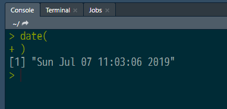
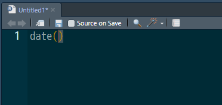
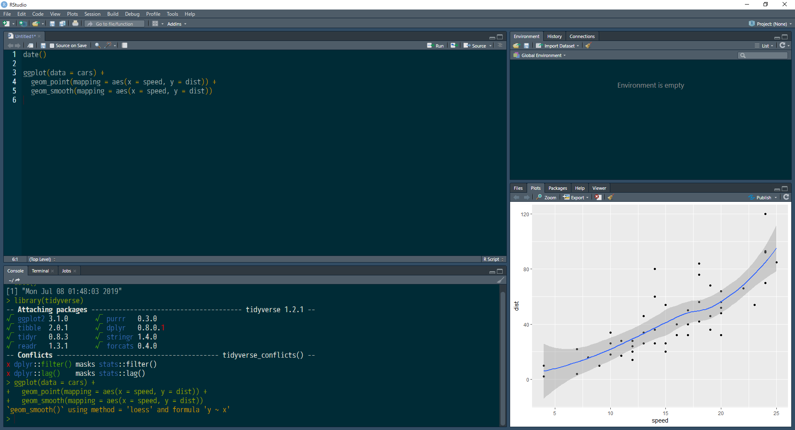

# コードを書く

RStudioでのデータ分析作業の基本は、
コンソール上でコマンドを実行し、
その結果を見てさらに別のコマンドを実行するという作業を繰り返す
インタラクティブな作業です。
ここまでに、コンソール上では、コマンド履歴の呼び出しや補完機能が働く事を紹介しました。

更に、コンソール上でのコマンド入力は複数に分けて行うことが出来ます。

## 複数行入力

### 複数行入力と第２プロンプト "+"

例えば、試しに、`date(`とプロンプトに入力してください。
この時、通常、補完機能が働いて自動的に`date()`と括弧を閉じて、
自動的にその括弧の間に、カーソルが来ますが、
その状態からカーソルを動かして右側の括弧を削除して`date(`という状態にします。
それから、Enterキーを押します。
プロンプトがあった次の行の左端に `+` 文字が表示されるはずです。これは、第２プロンプトと呼ばれるもので、
「まだ続きのコマンド入力を受け付けていますよ」という事を示すプロンプト記号です。
これは加算演算子では無いことに注意しなければなりません。
では、ここで閉じ括弧 `)` を入力してEnterキーを押してください。
`date()`コマンドが実行されます。（図\@ref(fig:longcode002)）


```{r longcode002, echo=FALSE, out.width="70%", fig.cap="複数行入力"}

```

コンソール上では、Enterキーが押された時に、現在の行内で括弧が閉じられていない時、または、
行末に演算子があり、右辺の入力がなされていない時には、コマンド入力が完成していないものと判断し、
エラーではなく、次の行に第二プロンプトを出して、さらなる入力を促してくれます。

関数の引数が沢山あったり、演算子を何個もつないだ長い計算式の場合、
１行がとても長くなって意味がわかりにくくなりますし、編集作業も大変になります。
このような場合に、コンソールの複数行入力機能は、便利に使えそうに思えますが、
実際に使ってみると、それほど便利ではありません。
RStudioでの長いコマンドの入力に関しては、次の項目から紹介するスクリプトやrmarkdownを使います。

### 複数行入力のキャンセル

ここでは、コンソールの複数行入力になった場合のキャンセルの仕方だけを覚えておきましょう。
キャンセルはEscキーで出来ます。途中まで入力したコマンドをすべて放棄して、元のプロンプトに戻ることが出来ます。
自分で、意図的に複数行入力を行った場合は、問題ないのですが、
初心者のうちは、複雑な式を入力している際に
誤って括弧の対が不ぞろいになっていている状態で
Enterキーを押してもコマンドが実行されず、
意図していない複数行入力の状態になってしまい、
パニックになることがあります。
そして、このように複数行入力になってしまったら、
コマンド入力が不完全であるうちは、
いくらEnterキーを押してもコマンドが実行されず、
次の行に `+` が表示されるだけでその状態から抜け出せなくなることがあります。

ですから、皆さんはまず、複数行入力というものが存在することを認識し、
間違ってその状態になってしまったら、
Escキーで抜け出すことが出来るということを覚えておきましょう。

## スクリプト編集ペイン

ここまで、コンソールの複数行入力を紹介しました。
しかし、この複数行入力は実際に使ってみると、それほど便利ではありません。
行間移動が出来ないので、前の行で間違いが発見されてもその部分を編集出来ず、
結局、入力をキャンセルして１からコマンドを書き直すことになったりします。

そこでRStudioでは、長いコマンドの入力を行う時、コンソールの複数行入力機能の代わりに
**スクリプト**ファイルの編集ペインを使うのが便利です。
スクリプトファイルは、通常、複数のコマンドを書き込んでおいて、
それらコマンドを連続で一気に実行させるためのそのファイルのことを言います。
いわゆる**プログラム**が書いてあるファイルをイメージすればOKです。

では早速、スクリプトファイルを実際に使ってみましょう。
RStudioの一番上に並んでいるメニューから File > New File > R Script を選択します。
すると、左上ペインが開き、`Untitled1`と書かれたタブが作成されます。
この新しく、開いたペインがスクリプトファイルの編集画面です。
この編集領域はWindowsのメモ帳のようなもので、
キーボードから自由に文字を書き込むことが出来ます。

```{r scriptpane001, echo=FALSE, out.width="90%", fig.cap="左上ペインのスクリプト編集領域"}
knitr::include_graphics("images/scriptpane001.png")
```

### 編集行コマンドの呼び出し

まずは、スクリプトファイルという**ファイル**であるということを意識せずに使ってみましょう。
編集領域に`date()`と書き込んでみます。
書き込めたら、カーソルが`date()`と書き込まれている行にある状態で、CtrlキーとEnterキーを同時押しします。

```{r codewrite001, echo=FALSE, out.width="70%", fig.cap="この状態で Ctrl + Enter"}

```

そうしたら、RStudio左下ペインのConsoleタブを確認してください。
プロンプトに`date()`コマンドが自動的に入力されて、実行され、そして、結果も表示されているはずです。

このように、RStudioでは、Ctrl + Enterキーによって、
スクリプト編集領域に書き込まれた１つのコマンドだけを
コンソールに呼び出して実行出来るようになっています。

この呼び出しは、コンソールの複数行入力と同じように
改行を使って１つの式（コマンド）を複数行に分けていても
１つの式として認識してくれます。
そこで今度は、もう少し長いコマンドに挑戦してみましょう。

### 編集行コマンド（複数行）の呼び出し

ますは、コンソールのプロンプトで`library(tidyverse)`を実行してください。[^1]

[^1]: tidyverseパッケージ群のインストールが必要です。

次に、以下のコマンドを編集領域に書き込んでください。
補完機能を使うこともできますし、
どこか間違ってもその部分をいくらでも編集できます。

```{r eval=FALSE}
ggplot(data = cars) +
  geom_point(mapping = aes(x = speed, y = dist)) +
  geom_smooth(mapping = aes(x = speed, y = dist))
```

ここで、このコマンドをよく見てもらうと、
1行目と2行目の行末に `+` 演算子があります。
演算子の右側には右辺が来るので、コマンドが続いていることを表しています。
そして、このようにコマンドが続いている場合に改行されている時は、
コードを書く上での慣習として[^1]
**インデント**と呼ばれる字下げを使って、コードのまとまりがわかりやすいように表現されます。
通常、このインデントは、RStudio等が自動でつけてくれます。

[^1]: インデントが慣習ではなく文法となっている言語もあります。

このように複数行に亘って入力されたコマンドは、
そのコマンドのどの行にカーソルを置いてもいいので、
その状態で先ほどと同じように Ctrl + Enterキー を押してください。
コンソールのプロンプトに複数行コマンドが入力され、実行されます。（図\@ref(fig:codewrite002)）

```{r codewrite002, echo=FALSE, out.width="90%", fig.cap="複数行コマンドの呼び出し"}

```

### 複数コマンドの呼び出し

コンソールのコマンド呼び出しは、
編集領域内の複数コマンドをShift + カーソルキー等で**選択**し、
その状態で、Ctrl + Enterキーでコンソールにコマンドを呼び出すと、
それら選択された複数コマンドがコンソールで順次実行されます。

### スクリプトファイルの本来の使い方

スクリプトファイルは一番最初に述べた通り、
本来、複数の処理をファイルに書いて保存しておき、
必要な時にこのファイルを呼び出すと、
そのファイルの中の処理が順に実行されるというものです。

そして、ここまでで述べた、
コマンド行をよびだしてコンソールで実行させる機能は、
スクリプトファイルの一部だけを動かしてテストするための機能を利用しているだけに過ぎませんし、
スクリプトファイルにコードの断片をあれこれ書いておき、
必要な部分をコピーして、コンソールに張り付けるという使い方は、
本来的な使い方ではありません。

コードを描くのが慣れてきたら、
スクリプトには、よく使う手順を関数として定義し、
作業時にはそのスクリプトを読み込んで、
その関数を使って作業するという使い方をするようになります。


### スクリプトファイルとして保存する

最後に、この編集領域は、保存を行うまでファイルとして
存在していないことに注意してください。
保存は、タブ上部にあるフロッピーディスクアイコンをクリックして行えます。
始めて保存するときに、ファイル名を決定します。
そうすることで、タブ名がUntitledから決定したファイル名に変更されます。
また、保存される場所は、カレントディレクトリからの相対位置です。


# 分析内容をレポートする

RStudioには、プログラミングコードとそれを実行した結果をレポートとしてまとめる機能があります。
その一つが、**R Notebook**と呼ばれるものです。


