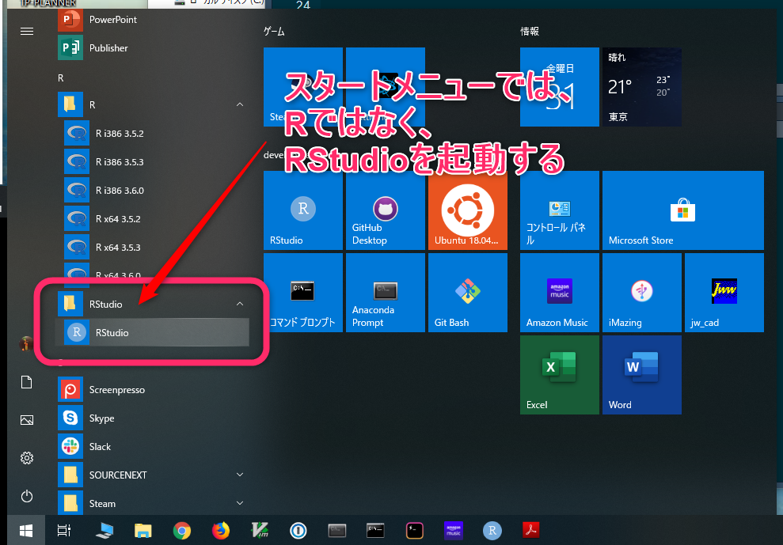
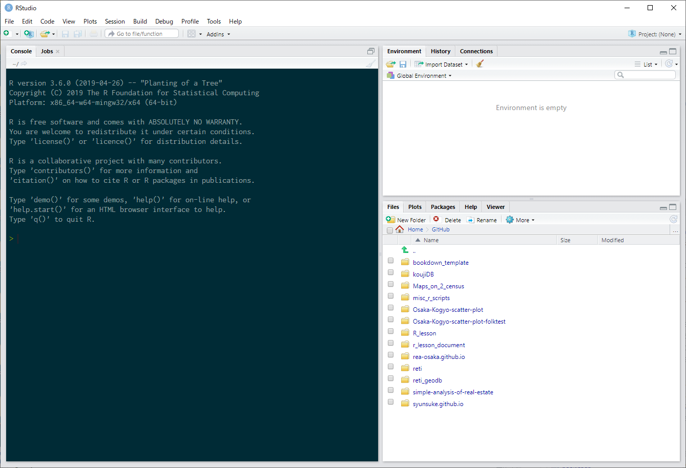
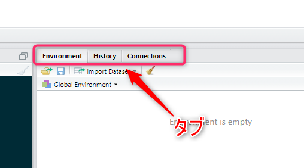

--- 
title: "Rビギナーズガイド"
author: "Syunsuke Fukuda"
date: "`r Sys.Date()`"
site: bookdown::bookdown_site
documentclass: bxjsbook
classoption: xelatex,ja=standard
---

```{r setup, include=FALSE}
knitr::opts_chunk$set(echo = TRUE, cache = TRUE, fig.align = "center")

# 出力フォーマットが TeX（PDF含む）の場合のみ対処する
if (knitr::opts_knit$get("rmarkdown.pandoc.to") %in% c("beamer", "latex")) {

  # conversion failure on '...' in 'mbcsToSbcs' の Warning 発生の workaround
  options(device = function(file, width = 7, height = 7, ...) {
    cairo_pdf(tempfile(), width = width, height = height, ...)
  })
  
  ## 1. cairo_pdf を使う方法
  # * family には OS にインストールされているフォント名を指定する。
  knitr::opts_chunk$set(dev="cairo_pdf", dev.args=list(family="Meiryo"))
}
```

# 初めてのRStudio

Rやプログラミング初心者、自称文系でパソコンに対する知識があまりない方へのガイドです。

コンソール上でのコマンドやファイルパスに関する知識を紹介したうえで、
統合開発環境RStudioに触れてもらい、
最終的にR Notebookで作業が出来るようになることが目標です。


## 何を起動するのか

[初心者向けRのインストールガイド](https://syunsuke.github.io/r_install_guide_for_beginners/)
に従って準備作業された場合には、RとRStudioがインストールされていると思います。
ですから、Windowsのスタートメニューを見ると、RとRStudioの２つがあります（図\@ref(fig:windowsStartMenu)）が、このうち、これから皆さんが使っていくのは**RStudio**の方です。

**R**は、R言語を処理するためのプログラムであり、
入力されたコマンドを解釈して処理し、
その結果を出力するプログラムです。
そして、**それ以外のこと**は殆どしてくれません。

プログラミングの経験があまりない方にとっては、「それ以外のことって何？
パソコンはただ計算して処理してくれるものだし、それで十分じゃないの？」と思われるかもしれません。

しかし、実際のプログラミング作業では、
正確なコマンド入力を行い、
プログラミングの流れを正確に把握し、
沢山の必要となるファイルを管理する必要があります。
そして、この何千行もあるプログラミングコードの中のただの一文字を間違えたただけでも、
プログラムは正しく動いてくれなくなります。

そこで、このように面倒なプログラミング作業を正確に行うためには、
通常、「それ以外のこと」が大いに必要となります。
一般的に、プログラミング作業を行う場合には、
この「それ以外のこと」もひっくるめて、
誰でも正確なプログラミングが簡単にできるように
プログラミング作業をサポートしてくれるソフトを使うことになります。

このプログラミング作業をサポートしてくれるソフトのことを
**統合開発環境**と呼びます。英語では、Integrated Development Environmentと呼ばれるため、
略して**IDE**とも呼ばれます。
このIDEには、沢山のものがありますが、
Rのプログラミングを行う際に定番なIDEは、**RStudio**です。

ですから、Rの作業を行う時は、
Windowsのスタートメニューから**RStudio**を起動します。


```{r windowsStartMenu, echo=FALSE, out.width="95%", fig.cap="スタートメニュの中のRStudio"}

```


## ペインとタブ

RStudioを立ち上げて、まずは、RStudioの見た目に慣れましょう。
大雑把に見て３つの部分に分かれていることが把握できるはずです。
（図\@ref(fig:rstudiolook001)）
この区分されている一つ一つの部分を区画や**ペイン**と呼びます。

```{r rstudiolook001, echo=FALSE, out.width="80%", fig.cap="ペインで構成されるRStudio"}

```


そして、その各ペインの上部に注目してもらうと、
どのペインにもタブを見つけることが出来るはずです。（図\@ref(fig:rstudiotab)）
タブは、それをクリックすることでペインの内容を切り替えることが出来ます。


```{r rstudiotab, echo=FALSE, out.width="70%", fig.cap="ペイン上部のtab"}

```


RStudioは、小さな画面の中に沢山の機能が詰め込まれているので、
タブの文字やその周辺に表示されているアイコン、
更にはその他の情報の文字が非常に小さくなっています。
ですから、いつも見ている画面なのに、その存在を意識することがないと、
それがそこにあることさえ気づかないこともあります。

まずは、RStudioは、いくつかのペインで構成され、
各ペインはその内容をタブで切り替えられるということを把握しましょう。


## コンソール

立ち上げたばかりのRStuido（図\@ref(fig:rstudiolook001)）は、左側のペインにコンソールが表示されています。
タブ名がConsoleになっていることを確認しましょう。

**コンソール**は、ユーザーからのRコマンドを受け付け、それを処理して、結果を表示してくれる場所です。

起動したばかりのRStudioのコンソールには、
内部で動いているR処理プログラムのバージョンについて述べられ、
続いて、ライセンスやRを支える開発貢献者等、
更に、ヘルプ等を見るためのコマンドの紹介がなされ、
最後に、Rを終了するためのコマンドが記されています。

そして、これらメッセージの後ろに ">"（大なり記号） が行頭にぽつんと表示され、
その右側に "|"（縦棒）が点滅しているのが見て取れるはずです。
この、">"の印のことを**プロンプト**といいます。
そして、"|"の印のことを**カーソル**といいます。


コンソールでの作業は、まず、プロンプトに対して、コマンドとして意味のある文字列を入力し、
入力が完了したら、キーボードの**Enterキー**を押して、入力したコマンドをRに処理させます。
そして、その処理がおわると、Rはコンソール上に何らかの結果を表示し、
再び、コンソールにはプロンプトが現れ、コマンド入力待ちの状態に戻ります。


では早速、実践してみましょう。
プロンプトに対して`1 + 2 + 3`というコマンドを入力し、実行してください。

1. コンソールのプロンプトに`1 + 2 + 3`と書き込む
2. Enterキーを押す
3. 結果をみる

```{r}
1 + 2 + 3
```


実は、このプロンプトは、 「コマンドの入力を受け付けています」という意味を持っています。

コマンドを実行して処理をしている最中には、このプロンプトは表示されません。 普段は、あっというまに処理が終わるので、 いつでもプロンプトが表示されているように見えますが、 時間のかかる処理をしている時には、 なかなかプロンプトが表示され無い事もあります。 つまり、コンソールにプロンプトが無い時は、前のコマンドの処理中なので、 次のコマンドを入力するためには、前のコマンドの処理が終わり、 プロンプトが表示されるのを待つ必要があります。


