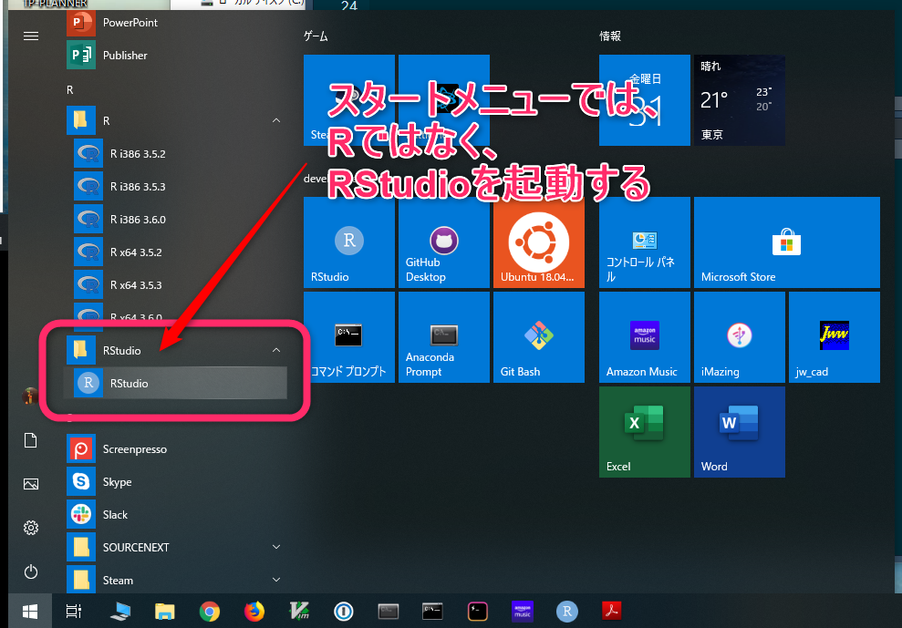
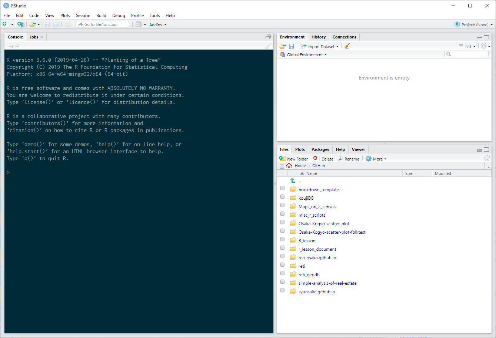
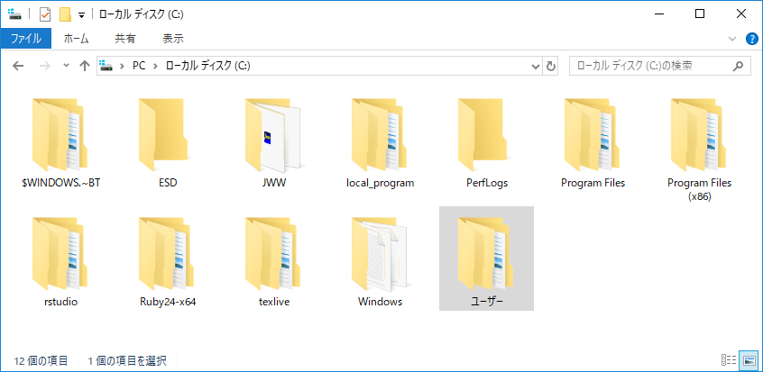

--- 
title: "Rビギナーズガイド"
author: "Syunsuke Fukuda"
date: "`r Sys.Date()`"
site: bookdown::bookdown_site
documentclass: bxjsbook
classoption: xelatex,ja=standard
---

```{r setup, include=FALSE}
knitr::opts_chunk$set(echo = TRUE, cache = TRUE, fig.align = "center")

# 出力フォーマットが TeX（PDF含む）の場合のみ対処する
if (knitr::opts_knit$get("rmarkdown.pandoc.to") %in% c("beamer", "latex")) {

  # conversion failure on '...' in 'mbcsToSbcs' の Warning 発生の workaround
  options(device = function(file, width = 7, height = 7, ...) {
    cairo_pdf(tempfile(), width = width, height = height, ...)
  })
  
  ## 1. cairo_pdf を使う方法
  # * family には OS にインストールされているフォント名を指定する。
  knitr::opts_chunk$set(dev="cairo_pdf", dev.args=list(family="Meiryo"))
}
```

# 初めてのRStudio

Rやプログラミング初心者、自称文系でパソコンに対する知識があまりない方へのガイドです。


## 何を起動するのか

Rの準備作業では、RのインストールとRStudioのインストールを行いました。
ですから、Windowsのスタートメニューをよくみると、RとRStudioの２つがあります（図\@ref(fig:windowsStartMenu)）が、このうち、これから皆さんが使っていくのは**RStudio**の方です。

**R**は、R言語を処理するためのプログラムであり、
入力されたコマンドを解釈して処理し、
その結果を出力するプログラムです。
そして、**それ以外のこと**は殆どしてくれません。

プログラミングの経験があまりない方にとっては、「それ以外のことって何？
パソコンはただ計算して処理してくれるものだし、それで十分じゃないの？」と思われるかもしれません。

しかし、実際のプログラミング作業では、
正確なコマンド入力を行い、
プログラミングの流れを正確に把握し、
沢山の必要となるファイルを管理する必要があります。
そして、この何千行もあるプログラミングコードの中のただの一文字を間違えたただけでも、
プログラムは正しく動いてくれなくなります。

そこで、このように面倒なプログラミング作業を正確に行うためには、
通常、「それ以外のこと」が大いに必要となります。
一般的に、プログラミング作業を行う場合には、
この「それ以外のこと」もひっくるめて、
誰でも正確なプログラミングが簡単にできるように
プログラミング作業をサポートしてくれるソフトを使うことになります。

このプログラミング作業をサポートしてくれるソフトのことを
**統合開発環境**と呼びます。英語では、Integrated Development Environmentと呼ばれるため、
略して**IDE**とも呼ばれます。
このIDEには、沢山のものがありますが、
Rのプログラミングを行う際に定番なIDEは、**RStudio**です。

ですから、Windowsのスタートメニューからあなたが起動するのは、
**RStudio**なのです。

```{r windowsStartMenu, echo=FALSE, out.width="95%", fig.cap="スタートメニュの中のRStudio"}

```


## ペインとタブ

RStudioを立ち上げて、まずは、RStudioの見た目に慣れましょう。
おおざっぱにみて３つの部分に分かれていることが把握できるはずです。（図\@ref(fig:rstudiolook001)）
この区分されている一つ一つの部分を区画や**ペイン**[^1]と呼びます。

```{r rstudiolook001, echo=FALSE, out.width="80%", fig.cap="ペインで構成されるRStudio"}

```


そして、その各ペインの上部に注目してもらうと、
どのペインにもタブを見つけることが出来るはずです。（図\@ref(fig:rstudiotab)）
タブは、それをクリックすることでペインの内容を切り替えることが出来ます。


```{r rstudiotab, echo=FALSE, out.width="70%", fig.cap="ペイン上部のtab"}
knitr::include_graphics("images/tab_right_upper.png")
```


RStudioは、小さな画面の中に沢山の機能が詰め込まれているので、
タブの文字やその周辺に表示されているアイコン、
更にはその他の情報の文字が非常に小さくなっています。
ですから、いつも見ている画面なのに、その存在を意識することがないと、
それがそこにあることさえ気づかないこともあります。

まずは、RStudioは、いくつかのペインで構成され、
各ペインはその内容をタブで切り替えられるということを把握しましょう。


[^1]: 英語でpaneは、区分をあらわしますが、もともと1枚のガラスや格子という意味でも使われます。
日本語の解説でも、アプリケーション画面がいくつかに区分されているものは、
その区分をペインという名称で説明していることが多いです。


## コンソール

立ち上げたばかりのRStuido（図\@ref(fig:rstudiolook001)）は、左側のペインにコンソールが表示されています。
タブ名がConsoleになっていることを確認しましょう。

**コンソール**は、ユーザーからのRコマンドを受け付け、それを処理して、結果を表示してくれる場所です。

起動したばかりのRStudioのコンソールには、
内部で動いているR処理プログラムのバージョンについて述べられ、
続いて、ライセンスやRを支える開発貢献者等、
更に、ヘルプ等を見るためのコマンドの紹介がなされ、
最後に、Rを終了するためのコマンドが記されています。

そして、これらメッセージの後ろに ">"（大なり記号） が行頭にぽつんと表示され、
その右側に "|"（縦棒）が点滅しているのが見て取れるはずです。
この、">"の印のことを**プロンプト**[^2]といいます。
そして、"|"の印のことを**カーソル**といいます。

[^2]:英語で prompt は、幾つかの意味がありますが、
その一つに、促してさせるという意味があります。
プロンプトは、ユーザーの入力を促している場所なのです。


コンソールでの作業は、まず、プロンプトに対して、コマンドとして意味のある文字列を入力し、
入力が完了したら、キーボードの**Enterキー**を押して、入力したコマンドをRに処理させます。
そして、その処理がおわると、Rはコンソール上に何らかの結果を表示し、
再び、コンソールにはプロンプトが現れ、コマンド入力待ちの状態に戻ります。


では早速、実践してみましょう。
プロンプトに対して`1 + 2 + 3`というコマンドを入力し、実行してください。

1. コンソールのプロンプトに`1 + 2 + 3`と書き込む
2. Enterキーを押す
3. 結果をみる

```{r}
1 + 2 + 3
```


実は、このプロンプトは、 「コマンドの入力を受け付けています」という意味を持っています。

コマンドを実行して処理をしている最中には、このプロンプトは表示されません。 普段は、あっというまに処理が終わるので、 いつでもプロンプトが表示されているように見えますが、 時間のかかる処理をしている時には、 なかなかプロンプトが表示され無い事もあります。 つまり、コンソールにプロンプトが無い時は、前のコマンドの処理中なので、 次のコマンドを入力するためには、前のコマンドの処理が終わり、 プロンプトが表示されるのを待つ必要があります。


<!--chapter:end:index.Rmd-->

# コンソールとコマンド

## コマンド

プロンプトに対して渡すコマンドの基本形を見てみましょう。

### 四則演算

プロンプトに対して、通常の四則演算式を入力すれば、
電卓変りに使うことが出来ます。

```{r}
# 四則演算
(350 + 120) * (100 - 20) / (10 * 10)
```

### 関数

通常のコマンドは、Rの**関数**を入力して実行します。
まずは、現在の時間を教えてくれる`date()`という関数を試してみましょう。

```{r}
# 現在の時刻を表示する関数
date()
```

関数には決まったパターンがあります。
`date()`を見て把握できる通り、関数は、必ず、関数名とそれに続く括弧から成り立っています。
上記の例である`date()`は、かっこの中に何も書いてありませんでしたが、
括弧の中には**引数**と呼ばれるものが入ることもあります。
引数は、「ひきすう」と読みます。

では、引数をとる関数を試してみましょう。`sum()`関数は、引数として渡された数字の合計を返してくれます。


```{r}
# 引数として渡された数字を合計するsum()関数
sum(1, 2, 3, 4, 5)
```

この様に複数にカンマを使って区切ることで、関数には複数の引数を渡すことが出来ます。

関数の引数は、その各関数によって、どのような引数を取るのかが決まっています。
また、その引数の場所に意味があったり、
引数を省略すると自動的に既定値（デフォルト値）をとることもあります。

このような引数に関するルールについては、のちに学習することになりますが、
ここでは、まず、関数は引数を取ることがあるという基本的な事を把握できれば十分です。


## 履歴機能

先のsum()関数では、1から5までの数字を合計しました。
次は、１から6までの数字を合計したいとしましょう。
実際の計算作業においても、
一度行った計算の一部を調整して、再度、似たような計算を行うこともあると思います。
そんな、作業をサポートしてくれるのが履歴機能です。

コンソールにフォーカスがある状態で、カーソルキーの**上矢印"↑"をキー**押してください。
（図\@ref(fig:cursorkey001)）
前回実行したコマンドがプロンプト上に入力された状態になりましたか？
何度もこのカーソルの上矢印キーを押すと、
どんどん、前に入力して実行したコマンドに変わっていくはずです。
これを**履歴機能**と呼びます。
今度は、**下矢印"↓"キー**を押して下さい。
そうです、行き過ぎたら戻ればよいわけです。

```{r cursorkey001, echo=FALSE, out.width="70%", fig.cap="キーボードのカーソルキー"}
knitr::include_graphics("images/cursorkey001.jpg")
```

このように、面倒で複雑なコマンドも１度入力してしまえば、
いつでも指一本で簡単に呼び出せるようになります。
ですから、似たようなコマンドは１から打ち込むことなく、
以前実行したコマンドを再度呼び出し、
必要な部分のみを修正するだけでよくなるので、入力が格段に簡単になります。

では、1から6までの合計値を計算してみてください。

```{r}
# 履歴を活用して1から6の合計値を計算する
sum(1, 2, 3, 4, 5, 6)
```

## 補完機能

補完機能は、コマンドや変数を途中まで入力しさえすれば、
残りの部分を適切に補って入力してくれる機能です。

システムの保持している日時を出力してくれる`Sys.Date()`関数で実践してみましょう。
プロンプトに`Sys.`と入力してください。
入力している傍にメニューが現れ、その中に`Sys.Date`を見つけることができるはずです。（図\@ref(fig:complete001)）

```{r complete001, echo=FALSE, out.width="70%", fig.cap="補完メニュー"}
knitr::include_graphics("images/complete001.png")
```


カーソルキーを使って、`Sys.Date`を選択してから、
EnterキーかTabキーを押すと、プロンプトに`Sys.Date()`が入力されます。

プロンプトへの入力中、補完メニューが出ていない状態で、Tabキーを押すと、
補完メニューを呼び出すことが出来ます。
補完メニューを呼び出したまま、入力を続けると、補完候補がリアルタイムで絞り込まれていきます。
補完候補は、コマンド等の綴りを正確に覚えていない時でも、
適当に試しながら探すことが出来ます。
例えば、よく使う`library()`関数の正確なつづりに自信がなくても、
`lib`さえわかれば、補完で何とかなります。

また、一旦、補完メニューを呼び出すと、連続した文字列でなくても絞り込みが効くようになります。
例えば、`read.csv()`関数という、csvファイルを読み込む関数があります。この関数を補完する際、
まず、`r`と一文字書いた時点で、tabキーで補完メニューを呼び出します。
この状態では当然、沢山の補完候補が表示されます。
しかし、この状態で、続けて`csv`、
すなわち、`rcsv`となるように入力を行って絞り込んでみてください。
このような補完検索のコツは、一旦、メニューを開くところにあります。
プロンプトに対して、メニューを開かず、いきなり、`rcsv`と入力してもうまくいきません。


さて、補完対象となるのは、関数名をはじめ、変数名、このあと紹介するファイルパス、ライブラリなどがあります。
また、RStudioでは、プロンプト上に限らず、ダイアログ内での入力でも補完が聞くこともあります。
とりあえず、よくわからないときは`Tabキー`で補完の問い合わせをしてみましょう。
プログラムでは、コードが一文字間違っても動きません。
コードの正確性をあげてケアレスミスを防止するため、そして、精神的ストレスを軽減するため
補完機能や、履歴機能を活用していきましょう。


## 複数行入力

ここまでに、コンソール上では、コマンド履歴の呼び出しや補完機能が働く事を紹介しました。
更に、コンソール上でのコマンド入力は複数に分けて行うことが出来ます。

### 複数行入力と第２プロンプト "+"

例えば、試しに、`date(`とプロンプトに入力してください。
この時、通常、補完機能が働いて自動的に`date()`と括弧を閉じて、
自動的にその括弧の間に、カーソルが来ますが、
その状態からカーソルを動かして右側の括弧を削除して`date(`という状態にします。
それから、Enterキーを押します。
プロンプトがあった次の行の左端に `+` 文字が表示されるはずです。これは、第２プロンプトと呼ばれるもので、
「まだ続きのコマンド入力を受け付けていますよ」という事を示すプロンプト記号です。
これは加算演算子では無いことに注意しなければなりません。
では、ここで閉じ括弧 `)` を入力してEnterキーを押してください。
`date()`コマンドが実行されます。（図\@ref(fig:longcode002)）


```{r longcode002, echo=FALSE, out.width="70%", fig.cap="複数行入力"}
knitr::include_graphics("images/longcode002.png")
```

コンソール上では、Enterキーが押された時に、現在の行内で括弧が閉じられていない時、または、
行末に演算子があり、右辺の入力がなされていない時には、コマンド入力が完成していないものと判断し、
エラーではなく、次の行に第２プロンプトを出して、さらなる入力を促してくれます。
例えば、関数の引数が沢山あったり、演算子を何個もつないだ長い計算式の場合、
１行がとても長くなって意味がわかりにくくなりますし、編集作業も大変になります。
このような場合に、コンソールの複数行入力機能は、便利に使えそうに思えますが、
実際に使ってみると、コマンド履歴が１行毎であったり、前の行にもどって編集作業が出来ない等、
それほど便利ではありません。

ですから、実際にはこの機能を積極的に使う場面はないとおもいますが、
次の項で述べる、複数行入力のキャンセルの仕方は必ず覚えておきましょう。

### 複数行入力のキャンセル

複数行入力の**キャンセルはEscキー**で出来ます。
途中まで入力したコマンドをすべて放棄して、
元のプロンプトに戻ることが出来ます。
自分で、意図的に複数行入力を行った場合は、問題ないのですが、
初心者のうちは、複雑な式を入力している際に
誤って括弧の対が不ぞろいになっていている状態で
Enterキーを押してもコマンドが実行されず、
意図していない複数行入力の状態になってしまい、
パニックになることがあります。
そして、このように複数行入力になってしまったら、
コマンド入力が不完全であるうちは、
いくらEnterキーを押してもコマンドが実行されず、
次の行に `+` が表示されるだけでその状態から抜け出せなくなることがあります。

ですから、皆さんはまず、複数行入力というものが存在することを認識し、
間違ってその状態になってしまったら、
Escキーで抜け出すことが出来るということを必ず覚えておきましょう。


## 変数と代入

プログラミングをしたことが無い人ならば、
まずは単純に、変数とは名前の付いたデータの入れ物だと考えればＯＫです。

a という変数に、10という数を入れるならば、次のように書きます。

```{r}
# 変数に値を代入する
a <- 10
```

`<-`の部分は、変数にデータを代入する代入記号です。
`<`（小なり記号）と、`-`（ハイフン）の２文字を使って矢印のような形を書き込むことになりますが、
RStudio上では、Altキーと`-`ハイフンキーを同時押しすれば、一発で書き込むことが出来ます。

変数への代入を行うと、その代入された値はコンピューターの中に保持されます。
そして、RStudioは変数とその値についての情報を
右上ペインの`Environment`タブにまとめて表示してくれます。（図\@ref(fig:envtab001)）

```{r envtab001, echo=FALSE, out.width="70%", fig.cap="Environmentタブ"}
knitr::include_graphics("images/environmenttab001.png")
```


変数は、この保持する機能をもっているということを意識しましょう。
先ほど、1から6までの数字の合計値を計算しました。
しかし、実は、計算をして結果を表示させただけであり、
その結果を改めて他の計算に使おうと思っても既にそのデータはパソコン上にありません。
そこで、何らかの計算を行い、その計算結果を後から別の場所で使いたい場合には、
変数を使ってデータを保持しておく必要があるのです。

```{r}
# 計算結果を代入する
res <- sum(1, 2, 3, 4, 5, 6)
```

この変数resの内容は、右上ペインのEnvironmentタブに表示されている変数一覧で確認できるはずです。

では、1から6までの数字が合計されているので、それを使って、1から6までの数字の平均を求めてみましょう。
合計された数字をその個数6で割ればよいので、次のようになります。

```{r}
# 計算結果を使って更に計算する
res / 6
```

**変数**の性質については、これからたくさん学ぶべきものが出てきます。
しかし、まずは、代入記号を使って値を代入して、
その値を保持させ、これを後から使うことが出来るという点を把握しましょう。


## ベクトル

ベクトルという単語を聞くと、高校数学で習った「方向と大きさを持った量」を思い浮かべるかもしれませんが、
**Rでいうベクトルは、単なるデータの集合であり**、高校数学のベクトルとは異なります。
もう一つ、ベクトルの発音で悩む必要はありません。日本語では**ベクトル**で大丈夫です。

プログラミングの世界では、**ある一連のデータ**を扱うことが非常に多いです。
このため、Ｒだけでなくどんなプログラミング言語でも、データの集まりを扱うための仕組みがあります。
多くは、**配列**や**リスト**という名前で、それらの仕組みは呼ばれています。

まずは、**プログラミングの世界で扱う一連のデータ**とは、どんなものなのかを考えてみましょう。
例えば、ここで、ある人達にテストを受けてもらい、その結果が次のようになっているとします。

|名前|点数|
|:--:|:--:|
|レナード|100|
|シェルドン|100|
|ハワード|65|
|ラジェッシュ|60|
|ペニー|3|

このテストについての、最高点、最低点、平均点、中央値、標準偏差等を知るためには、
テスト結果の一つ一つの点数が個別を入手できても計算はできません。
一連の点数が全てそろった、まとまりとしてのデータが必要です。
このひとまとまりのデータを扱うために、Rではベクトルを使います。

### ベクトルの作成

では、実際にベクトルを作りましょう。
ベクトルの作成には、`c()`関数を使います。`c()`関数の `c` はCombine（結合）の `c` です。
`c()`関数は、`,`カンマを使って複数の引数を渡し、ベクトルを作成します。
ここでは、上述のテストの一連の点数結果を複数の引数として`c()`に渡して下さい。

```{r}
# c()関数を使って一連のデータからベクトルを作成する
c(99, 100, 65, 60, 3)
```

実行すると、すぐに結果としてベクトルが表示されます。
その単純な数字の並び、それがベクトルです。

ここで、先に説明を行った**変数**の事を思い出してください。
今、作成したベクトルは、変数に代入していないので、
コンピューター上に保持されていません。

ここで、練習問題です。
このテスト結果のベクトルを`results`という変数に代入し、このデータを保持して下さい。


```{r}
# ベクトルを変数に代入してデータを保持する
results <- c(99, 100, 65, 60, 3)
```

チェックしてみましょう。

- 履歴機能は使えましたか？
- `<-`を上手に入力できましたか？

### データの型とベクトルの性質

右上ペインのEnvironmentタブを見てみましょう。
そこに、`results`変数が加わっているはずでが、
変数の内容は、先ほどの単純な数字の10や21と異なり、次の様になっているはずです。

```
num [1:5] 98 100 80 80 25
```

#### データの型{-}

この情報は、３つの部分から構成されています。
はじめの`num`は、**データの型**を表している部分です。
`num`は、は number すなわち、数値の略であり、
このベクトルのデータの型が**数値型**であることを表しています。

プログラミングを行う場合、その扱うデータには型というものが必ずあります。
数値型以外の典型的な型として、**文字列型**があります。

データ型の違いは、データの性質の違いを表しています。
ですから、データの型によって、出来る処理も異なります。
例えば、数値型のデータを使って、平均値等の計算ができますが、
文字列型のデータの平均値の計算は出来ません（意味論的にナンセンスという意味）。

ここで、この型を意識して、データを作成してみます。

まずは、数値型のデータを**作製**して、変数に代入してみます。
また、同時に`str()`関数を使って、作成したデータの型を確認します。
`str`はstructure（構造）の略で、引数に与えたデータの構造を表示してくれる関数です。

```{r}
# 数値型データの作成
n <- 123
str(n)
```

何かのコマンドを使用するわけでは無く、
式の中で単純に数字を書けば、それが数値型のデータとして作成されます。

次は、文字列型のデータを**作製**して、変数に代入してみます。

```{r}
# 文字列型データの作成
s <- "Hello World!"
str(s)
```

文字列を二重引用符で囲むことで、文字列型のデータを作成できます。
str()関数の出力には、このデータの型が`chr`である書かれていますが、これはcharacteor（文字）の略です。

#### ベクトルの型{-}

データに型があることがわかりました。
そして、実は複数データをとるベクトルにはこのデータの型について大きな約束事があります。
その約束事は、ベクトルを構成する**データの型は全て同じ**でなければならないということです。
ですから、データの型といってもいいですし、**ベクトルの型**といっても意味が通じます。
また、右上ペインのベクトルの内容表示に型は、データの型でありベクトルの型なのです。

### ベクトルと要素

Environmentタブの表示には、型の次に`[1:5]`という表示があります。
この表示は、**このベクトルには、１番から５番までのデータがあります**ということを示しています。つまり、この表示により、ベクトルに入っているデータの数を把握することが出来ます。

ベクトルは、ベクトルを構成する個別のデータは順序をもつという性質があります。
ですから、ベクトルの何番目のデータという表現を使うことで、
ベクトルを構成する個別のデータに一意に取り出すことが可能になっています。

このベクトルの要素を取り出すためには`[]`角括弧演算子を使います。
例えば、変数`results`に入っているベクトルの１番目の要素を取り出すには次のように書きます。

```{r}
# ベクトルにアクセスする[]演算子
results[1]
```

変数名の後ろに`[]`角括弧のペアを書き、
その中に何番目のデータにアクセスしたいのか、その**数値**を書き込みます。


### ベクトルを使って計算

では、テストの点数がベクトルにまとまったので、
テストに関する平均を計算しましょう。
平均の計算には`mean()`関数を使います。
この`mean()`関数の引数として、点数の入ったベクトルを渡す事で、平均の計算が出来ます。

```{r}
# 平均を計算する
mean(results)
```


## データフレーム

ベクトルは、順序のある一連のデータの集まりで１次元的データ構造でした。
これに対して、データフレームとは、２次元的なデータ構造をした、
表形式のデータの集まりです。
これは、エクセルの表のようなものだと認識してもらえれば結構です。

Rの大きな特徴の一つが、このデータフレームを簡単に処理できるところにあります。

Rには、沢山のサンプルデータがデータフレームの形で付随しています。
このサンプルの一つである`cars`データを見てみましょう。
`cars`データは、1920年代の自動車のスピードと停車できるまでの距離の関係の実験結果です。

コンソール上でプロンプトから`cars`と呼び出せば、データが表示されます。
しかし、ここでは、`cars_data`という変数を作ってそこに代入し、このデータを保持しましょう。


```{r}
# データフレームのサンプルデータcars
cars_data <- cars
```

### データをView()でみる

右上ペインのEnvironmentタブに`cars_data`が表示されます。
ここで、そのEnvironmentタブで`cars_data`と書かれている部分をクリックして下さい。
そうすると、左上ペインに表形式のデータフレームが表示されます。（図\@ref(fig:dataframe001)）

```{r dataframe001, echo=FALSE, out.width="90%", fig.cap="dataframeの表示"}
knitr::include_graphics("images/dataframe001.png")
```

コンソールを見てみると`View(cars_data)`というコマンドが書かれているのを見つけることが出来ます。
実は、変数名をクリックすることで、RStudioが自動的にフレームデータを見るためのコマンドを実行してくれているのです。
**`View()`関数**は、RStudioでデータを見るための関数です。
また、この関数は、Environmentタブの右端にある**表を表すアイコン**をクリックして呼び出すことも出来ます。


### 行と列

表形式のデータを扱うには、まず、行と列、その英語の省略形であるrowとcolを正確に暗記しましょう。覚え方は図\@ref(fig:rowcol001)

```{r rowcol001, echo=FALSE, out.width="70%", fig.cap="行と列の覚え方"}
knitr::include_graphics("images/rowcol.png")
```

Rのデータ分析で扱う表形式のデータは**整然データ**と呼ばれるルールに従ったデータになっています。
整然データでは、行と列はその役割が決まっており見やすさのために行と列を入れ替えたりすることは在りません。

carsデータを例に見ると、行はそれぞれの**観測**した車を表しており、
列は個々の観測で得られたスピードと距離という**個々のデータの内容**を表しています。
ですから、データフレームでは、行数がデータの件数、列数が各観測で観測したデータの種類の数を表します。

右上ペインのEnvironmentタブに表示されている情報は次のようなものでした。

```
cars_data    50 obs. of 2 variables
```

50 obs. は、50件のデータであり、50行あること。
2 variablesは、2列のデータの種類があり、すなわち、2列であることを示しています。
つまり、この表示を確認することでデータフレームの大きさを把握することが出来ます。


### 整然データとキーワード

variablesは、変数という意味の英語です。obs.は、observationの略で、観測という意味の英語です。
これらは、整然データについて勉強をするとよく出てくるキーワードです。

|行列|対応するキーワード|
|:---:|:---:|
|行|observation 観測|
|列|variable 変数|

データ分析を始める段階においては、
整然データの定義を精密に理解までしなくても、キーワードとして耳慣れておけば十分です。


### 列の名前と列へのアクセス

データフレームの列については、通常、その列データがなんであるかを示す**列名**が付けられています。
左上ペインに表示されている`View(cars_data)`の結果を見てください。列の一番上に、speedとdistと書かれているのを見つける事が出来るはずです。
（図\@ref(fig:dataframe001)） これが、それぞれの列の列名です。 
今度は、`str()`関数を使って、cars_dataの構造を確認してみましょう。

```{r}
# データフレームcars_dataの構造を確認する
str(cars_data)
```

1行目で、このデータが`data.frame`であることとその行と列の大きさの情報が示されます。
2行目以降は、各列についての情報が順に表示されています。
各列の情報は、`$`記号の後ろに、列名が表示され、その後ろにデータの型と具体的な内容の一部が表示されます。
すなわち、この方法でも、データフレームの列名を確認することが出来ます。

このcars_dataは、先に述べた通り、自動車のスピードと停車距離についての実験結果を表しています。
そして、今、確認した通り、スピードは`speed`列に、停車距離は`dis`列にそれぞれ、数値として入っています。

ここで、この実験が行われた際の平均スピードを求めたい場合、**データフレーム`cars_data`から、speedの列データだけを取り出す**必要が生じます。
これを行う一つの方法が`$`演算子です。

```{r}
#　cars_dataからspeed列を取り出す
cars_data$speed
```

データフレームの後ろに`$`記号を書き、その後ろに列名を書きます。
50個の数値が表示されていますが、取り出された結果が何かを改めて`str()`関数で確認していましょう。

```{r}
#　取り出されたデータの構造を確認する
str(cars_data$speed)
```

型名と要素の大きさが表示されました。これは、先に勉強したベクトルです。
これで、データフレームの列をベクトルとして取り出すことが出来るようになりました。

練習問題として、cars_dataで示される実験での、平均スピードを求めてみましょう。

```{r}
# cars_dataで示される実験での平均スピード
mean(cars_data$speed)
```

では、平均停車距離はどうでしょうか？
停車距離データが入っている列の列名が何かということを把握しましょう。

```{r}
# cars_dataで示される実験での平均停車距離
mean(cars_data$dist)
```


<!--chapter:end:02_command.Rmd-->

# パス

## ファイルを扱うために必要不可欠な知識

データ分析の対象となる多くのデータは、**CSVファイル**と呼ばれる形式のファイルとして配布されています。
そして、RStudioでデータ分析を行うためには、必ず、
このCSVファイルのような分析の対象となるデータをもっている**ファイルをRに読み込む**必要があります。
また、Rを使ったより複雑な処理を行う時、その処理をファイルに記述して保存します。
これら保存された処理は、他の処理からそのファイルを読み込むことで利用したりします。
このように、Rの処理を行う場合に、ファイルを扱う作業は必須となります。

ここで、普段使っているWindowsの環境では、何かのファイルを指定する時、
画面を見て目の前にあるファイルのアイコンにマウスカーソルを持って行き、
それをクリックするだけで済みます。
もしくは、何かのアプリのメニューからファイル選択用のダイアログを呼び出し、それを使ってファイルを選択します。
しかし、コンソール上での作業では、アイコンやメニューやダイアログはありません。
ファイルの指定もコマンドとして文字を書く事でその作業を行っていきます。
この時、パソコン上にあるファイルを特定するために必要となるのが**パス**です。

## Windowsのディレクトリ構成

Windows上のファイルは、**ドライブ**の中にある**ディレクトリ**の中、若しくは、ディレクトリの中のディレクトリ（又は、そのディレクトリの中のディレクトリの中の、、、、）に存在しています。
尚、ディレクトリはWindowsではフォルダと呼ばれることもあります。
普段、デスクトップや自分のドキュメントフォルダ等へ
データを保存していると思いますが、これらの場所も全て、ドライブから始まるディレクトリ構造の一部になっています。

Windowsのエクスプローラーを使って実際に見てみましょう。
PCの中にあるCドライブをエクスプローラーで開いて下さい。（図\@ref(fig:directorytree001)）

```{r directorytree001, echo=FALSE, out.width="90%", fig.cap="Cドライブのルートディレクトリ"}

```

もちろん各人によって内容は異なりますが、最低限、次の様なフォルダが見られるはずです。

- Windows
- Program Files
- Users、若しくは、ユーザー

**`Windows`**フォルダは、Windows自体の色々なファイルやフォルダが入っています。
また、**`Program Files`**フォルダの中には、
あなたのWindowsにインストールされているプログラムの実行ファイル等が入ったフォルダが入っています。
そして、**ユーザー**フォルダの中には、
各アカウント名のフォルダが在り、その中を覗くと
自分がいつもデータを整理しているであろう見慣れたフォルダ名が並んでいると思います。

少し探索してどんなフォルダの中にどんなフォルダが入っているのか、
Cドライブからどんな順番であなたのデスクトップやドキュメントフォルダが
位置しているのか、Windowsのディレクトリ構造の大雑把なイメージを持って下さい。

## パスの書き方のルール

エクスプローラーでディレクトリ構造の探索を行ってみると、
例えば私（アカウント名shunsk）のデスクトップにあるsample.txtというファイルは、「Cドライブの中のユーザーディレクトリの中のshunskディレクトリの中のデスクトップディレクトリの中のsample.txt」という風に一意に言葉で説明することができることが分かります。そして、これを次のルールに基づいて表現することで、コンソール上で利用できるファイルパスになります。

- 先頭をドライブ名（CとかDとか）＋コロンではじめる
- ディレクトリを表すためにディレクトリ名を"/"（スラッシュ）で区切る

私のデスクトップ上のsample.txtのファイルパスは次のようになります。

```
C:/Users/shunsk/Desktop/sample.txt
```

もう少し、別の例も見てみましょう。

|パス|説明|
|:---|:---|
|C:/Users/shunsk/ |CドライブのUsersディレクトリの中のshunskディレクトリ|
|C:/|Cドライブの直下のディレクトリ|
|D:/data/text/hoge.txt|Dドライブのdataディレクトリの中のtextディレクトリの中のhoge.txtファイル|

## Windowsのパスの注意点

ここで、WindowsのパスをRで扱う時の注意点を述べておきます。

### ディレクトリを表す記号

まず、Windowsのシステム上でのパス表記において、
ディレクトリを表す記号には**円マーク**、若しくは、
これと同じ文字を意味する**バックスラッシュ**が使われています。
しかし、Rの文字列においては、バックスラッシュは特別の意味を持つ文字であるため、
単独でバックスラッシュの文字を使うことが出来ません。
そこで、Rのコンソール上では、ディレクトリ区切りを表現するためには、
必ず、**スラッシュ記号**を使います。

### ディレクトリ名称

次に、Windowsのディレクトリ名は、エクスプローラーで表示されるものと、
ファイルシステム上の名称で異なるものがあります。
上記の例では、エクスプローラーで**ユーザー**や**デスクトップ**と
日本語で表示されていても、
システム上のディレクトリ名は、UsersやDesktopとなっている場合があります。
RStudioでパスを入力する時は、
補完機能が使えるので真のディレクトリ名をわざわざ調べる必要はありません。
補完候補の中には、真のディレクトリ名があるので、そこから選択すればよいだけです。

### 間違えがちな所

パスの初めは、ドライブ名＋コロンの後に**まずスラッシュが入ります**
また、コンソール上でのパスは文字列として扱うので、必ず、**引用符で囲みます**。

|正誤|パス|
|:---|:---|
|正解|"C:/Users/"|
|間違い|C:Users|

### パス入力の実習

では、デスクトップに`sample.txt`というからのファイルを作成し、
このファイルパスを`sample_txt_path`という変数に代入してください。
ファイルパスの入力には必ず、補完機能を使います。

ファイルパス補完のコツは、まず、ドライブのルートディレクトリとして
`"C:/"`と書き込み、そのスラッシュの後ろでタブキーを押すと
ディレクトリ構造に従った補完候補が呼び出せます。

```{r}
# ファイルパスを補完機能で入力
sample_txt_path <- "C:/Users/shunsk/Desktop/sample.txt"
```

## カレントディレクトリ

Windowsを使っている場合には、ほとんど意識することがありませんが、
実は、パソコンの操作をしている時、
操作をしている人は必ず**どこかの場所(ディレクトリ)にいる**ことになっています。
そして、その場所を**カレントディレクトリ**（current directory: 現在のディレクトリ）やワーキングディレクトリと呼びます。

実際に、あなたが今どこにいるのか？あなたのカレントディレクトリを調べてみましょう。
カレントディレクトリのパスを出力する`getwd()`関数を実行してください。

```{r}
# カレントディレクトリを出力するコマンド
getwd()
```


出力は、実行した人ごとに異なります。

さて、まずは、この「**カレントディレクトリ**」という単語を覚えて、
「自分のいるディレクトリ」という概念があるということを意識しましょう。
また、カレントディレクトリは、コンソール毎にあります。
複数のRのコンソールを立ち上げている時には、
そのコンソール毎にカレントディレクトリは独立しています。


### カレントディレクトリとパスの種類

さて、先に説明したパスの表現は以下の様なものでした。

`"C:/Users/shunsk/Desktop/sample.txt"`

このようにドライブ名から表示したパスの書式を**絶対パス、完全パス、フルパス**等と呼びます。

これに対して、カレントディレクトリからの相対的な位置で表したパスの書式を**相対パス**といいます。

例えば、カレントディレクトリ内の`csvdata`ディレクトリにある
`hoge.txt`というファイルなら、
相対パスでの表現の仕方は、`"csvdata/hoge.txt"`となります。

相対パスを表現する文字列の先頭には、
ドライブ名やディレクトリを意味するスラッシュがなく、
カレントディレクトリ直下にある
**ファイル名やディレクトリ名そのものから始まります**。

表現の仕方をあらためて次にまとめておきます。

絶対パスで`"C:/Users/shunsk/Desktop/sample.txt"`となっているファイルについてのカレントディレクトリと相対パスの関係は次の通りです。

|カレントディレクトリ|相対パス|
|:---|:---|
|"C:/Users/"|"shunsk/Desktop/sample.txt"|
|"C:/Users/shunsk/"|"Desktop/sample.txt"|
|"C:/Users/shunsk/Desktop/"|"sample.txt"|

## カレントディレクトリを意識した作業

みなさんも、普段、パソコンを使って何かの作成作業を行っていると思います。
その作業では、作業ごとにフォルダを作成し、
その中にワードファイルやエクセルファイル、
写真等のイメージファイル、その他のデータファイル等を入れて
管理しているのではないでしょうか？
そして、作業をする時はこれらファイルの入っている**フォルダを開き**、
その中にあるファイルアイコンをダブルクリック等して作業をしていることと思います。

Rをコンソールで使う場合でも同様です。
Rの作業をする時に必要となるファイルをフォルダに入れて管理することになります。
ただ、Rでの作業はコンソールで行うので、視覚的にフォルダを開きませんが、
代わりに、その**フォルダをカレントディレクトリに設定**して、
各ファイルへのアクセスを容易にします。

ここから、カレントディレクトリを意識して、
実際のRでの作業を始めるための準備を体験してもらいます。

### デスクトップでの事前準備

まず、デスクトップに**`r_work`**というフォルダを作って下さい。
次に、作業対象となるCSVファイルを用意します。
適切な整然データのcsvファイルの例として、次のwebページから国土交通省が発表している不動産取引価格情報データのCSVファイルを入手できます。適当なcsvファイルを入手してください。
（手元に適切なデータがある場合は、それを使っても結構です。）

[http://www.land.mlit.go.jp/webland/download.html](http://www.land.mlit.go.jp/webland/download.html)

準備したcsvファイルをr_workディレクトリの中にコピーし、
コピーしたファイル名は**`my_data.csv`というファイル名に変更**しておいてください。


### カレントディレクトリの変更

デスクトップ上での準備が完了したら、
RStudioのコンソールのカレントディレクトリを
今、作成した`r_work`フォルダに変更する作業を行います。

カレントディレクトリの変更は、`setwd()`関数を使います。
`setwd()`関数には、
カレントディレクトリにしたいディレクトリのパスの文字列を引数として渡して使います。
各自のデスクトップへのパスはアカウント名が異なるため下の例とは異なるので、コピーアンドペーストでは失敗します。
必ず、補完機能を使って各自のデスクトップ上の`r_work`ディレクトリへのパスを入力しましょう。

```{r eval=F}
# デスクトップのr_workディレクトリをカレントディレクトリにする。
setwd("c:/Users/shunsk/Desktop/r_work/")
```

### ファイルの読み込み作業

整然データとしてのcsvファイルを読み込む関数の一つに
`read.csv()`関数があります。
この関数は、読み込みたいファイルのファイルパスを引数として取ります。
さて、この引数として渡すファイルパスは、上記で勉強した通り、
絶対パスと相対パスの両方で書けます。

まず、相対パスでデータを読み込んでみましょう。
読み込んだデータを保持するために、`data_a`という変数に代入してください。

```{r eval=F}
# 相対パスを使ってファイルを読み込む
data_a <- read.csv("my_data.csv")
```

このように、カレントディレクトリを適切に設定すると
ファイル読み込みを指示するコマンドのタイピング量は減り、
作業が便利になるように思えます。

では、作業をする時には、相対パスで指示すればよいのでしょうか？


### 相対パスと絶対パス

相対パスを使うには、前述の通り前提条件が必要です。
上記の作業では、ファイルを読み込む前に、カレントディレクトリの変更を行い、
カレントディレクトリが`my_data.csv`を入れている`r_work`になっていることが
**確実な状態**です。

この様に、カレントディレクトリと対象となるファイルの
**相対的位置関係をきちんと把握できている**場合、
相対パスでファイルを正しく指定することが出来ます。
逆を言えば、カレントディレクトリが分からなければ、
相対パスでパスの指定をすることは出来ません。


次に、絶対パスでデータを読み込んでみましょう。
今度は、`data_b`という変数に代入します。

```{r eval=F}
# 絶対パスを使ってファイルを読み込む
data_b <- read.csv("c:/Users/shunsk/Desktop/r_work/my_data.csv")
```

絶対パスは、今使っているパソコン上のファイルの場所を一意に表しています。
ですから、カレントディレクトリが何処であったとしても、
正しくファイルの場所を指定することが出来ます。

上記の様にファイルの読み込み作業において、
絶対パスと相対パスの両方のコードで実践してみました。

この両パス表記は、どちらかが優れているというものではなく、
それぞれ、その性質に応じた使い方をします。
そして、どちらの表記であっても、
自分で読み書きできる必要があります。

まず、絶対パスを使う時は、
現在のカレントディレクトリを気にせず、
ダイレクトにパスを指定したい場合です。
例えば、カレントディレクトリのすぐ近くのディレクトリに
カレントディレクトリを移動させたい場合には、
相対的な関係を直感的に把握できますが、
構造的に離れたディレクトリへ移動する時には、
ディレクトリルートから辿る方が簡単です。

次に、絶対パスが使えない場合があることを把握しましょう。
それは、絶対パスの入ったコードは他人の環境で動かないという事です。
前述しましたが、私のデスクトップ上のファイルへの絶対パスは、
あなたのデスクトップ上のファイルへの絶対パスになりません。
ですから、絶対パスを使ったコードを
あなたがコピー＆ペーストして実行してもうまく動きません。

一方、他人とコードを共有する場合、
若しくは、自分のパソコンの中であっても、
そのコードの置き場所を何処にでも移動できるようにする場合、
パス表記全てをベースとなるディレクトリからの相対表記にしておき、
作業の時に、カレントディレクトリをそのベースディレクトリに設定することで、
ベースディレクトリの絶対パスが何処であっても、相対パスの表記は文字通り同じになります。
つまり、あなたが、適切なカレントディレクトリさえ設定すれば、
私の相対パスで書かれたコードをコピー＆ペーストするだけで、
あなたのパソコンでもそのコードが動くようになります。

以上の事を把握していれば、
Rの教科書でのファイルの読み込み作業で失敗することは無くなります。


## RStduioのプロジェクト

先ほどは、コマンドを使ってカレントディレクトリを変更することを覚えましたが、
Rで作業をする毎にわざわざカレントディレクトリを設定するのは面倒です。
そこで、RStudioは、このような煩雑な作業をしなくてすむように、
**プロジェクト**という機能を備えています。

RStudioでは、作業ディレクトリ毎にRStudioのプロジェクトファイルを作成しておきます。
そうすることで、そのプロジェクトファイルを開くだけで、
そのディレクトリがカレントディレクトリであるコンソールが開くようになります。
また、別のプロジェクトファイルを開くと、
その別の作業用のディレクトリをカレントディレクトリとする別のコンソールが開きます。
このように、RStudioでは、作業ディレクトリ毎のコンソールを別々に開いて複数の作業を同時に行う事が簡単にできます。

### プロジェクトの作成

では、早速プロジェクトを作成しましょう。
RStudioを立ち上げ、メニューのFileからNew Projectを選択します。[^3]
そうすると、プロジェクト作成ダイアログが表示されます。（図\@ref(fig:project001)）

[^3]: 既にコンソールで何かの作業をしていると、作業中の変数等の状況を保存しておくかどうかの確認ダイアログが出ますが、
特に必要が無い限り作業は保存しませんので、`Don't Save`ボタンをクリックすればＯＫです。


```{r project001, echo=FALSE, out.width="70%", fig.cap="プロジェクト作成ダイアログ"}
knitr::include_graphics("images/newproject_dl.png")
```


ここでは、選択肢が３つありますが、
今回は、一番手軽にプロジェクトを作成できる２番目の方法
「既に存在する作業フォルダをプロジェクトにする(Existing Directory)」を
紹介します。
この２番の方法さえ覚えておけば、新規にフォルダを作ってプロジェクトにする時も、
自分で新しいフォルダを先に作りさえすれば、この２番の方法を使って同じようにプロジェクトを作成することが出来ます。

では、ダイアログの`Existing Directory`の部分をクリックして下さい。
ダイアログが切り替わるので、ディレクトリ選択ダイアログ（Browseボタンから）等を使って、
プロジェクトにしたい既存のディレクトリのパスを指定します。
ここでは、先に作成したデスクトップ上にある`r_work`のパスを指定して下さい。
パスの指定が出来たら、
ダイアログ右下の`Create Project`ボタンをクリックして、
プロジェクトの作成作業は完了です。

デスクトップの`r_work`ディレクトリを
カレントディレクトリとしたRStudioのコンソールが開きます。
ここで、一旦、RStudioを終了しましょう。
右上の×ボタン等を使って終了して下さい。

さて、今までRStudioの起動は、Windowsのスタートメニューから行っていたと思います。
しかし、これからの作業はRStudioのプロジェクトファイルから起動することが出来ます。
デスクトップの`r_work`フォルダを開いて下さい。
ファイル名の拡張子が`.Rproj`となっていて、
Rの文字がついたアイコンのファイルが新たに作られているはずです。
これが、RStudioのプロジェクトファイルです。（図\@ref(fig:project002)）

```{r project002, echo=FALSE, out.width="70%", fig.cap="プロジェクトファイル"}
knitr::include_graphics("images/projecto002.png")
```

このディレクトリでの作業を開始する時には、
このプロジェクトファイルをダブルクリックする事で、
そのディレクトリをカレントディレクトリとしたコンソールを持つ
RStudioを起動することが出来ます。

### RStudioに小さく表示される情報

RStudioはプロジェクトごとに立ち上げることが出来ると述べましたが、
複数のRStuidoが立ち上がると、
どのRStudioがどのプロジェクトが見わけがつかなくなるかもしれません。

そんな時、右上ペインのその右上をよく見てください。
その他、カレントディレクトリを知るために`getwd()`関数を使っていましたが、
コンソールの上部、Consoleとタブに書かれているところのすぐ下をよく見てください。
RStudioには、小さなところにいろんな情報が隠れています。


<!--chapter:end:03_path.Rmd-->

# パッケージ

Rの**パッケージ**とは、関数やデータセットを集めたものです。
Rでは、パッケージをインストールすることで、 
機能を拡張することが出来る仕組みになっています。
Rの参考書等ではよく、
その説明の中で使われる関数を含んでいるパッケージのインストールが要求されます。

このパッケージは、世界各国の現場の研究者達や
RStudioチームをはじめとするオープンソース開発者達が
独自に開発して公開しています。
このパッケージには、**CRAN**を通じて公式に配布されているものと、
**GitHub**等を通じてプログラマが独自に配布しているものとがあります。

まず、CRANは、The Comprehensive R Archive Network（包括的Rアーカイブネットワーク）の略称で
Rに関するコードとドキュメントを配布しているサーバー群です。（図\@ref(fig:cranss001)）Rの本体もこのCRANで配布されています。
CRANは、シーランやクランと発音されているようです。
CRANは世界各国にミラーサーバーがあり、それらが常に同期されています。

```{r cranss001, echo=FALSE, out.width="90%", fig.cap="https://cran.r-project.org/"}
knitr::include_graphics("images/cran_ss001.png")
```


次に、GitHubは、
世界中のプログラマが沢山のプログラムのソースコードを公開している有名なWebサービスです。（図\@ref(fig:githubss001)）
プログラムの開発をサポートするサービスなので、
CRANに登録されているRのパッケージも、
その開発段階の最新のものはGitHub上にもあったりします。


```{r githubss001, echo=FALSE, out.width="90%", fig.cap="https://github.com/"}
knitr::include_graphics("images/github_ss001.png")
```

CRANに登録されているパッケージは、2019/5/31時点で14,307あります。
しかし、RのパッケージはCRANに登録されずにGitHub上のみで
公開されているものもあるので、世の中にあるRパッケージは上記の数よりもずっと多く存在します。
Rでは、これらの全てのパッケージをインストールしなければならないわけでは無く、
これらのうちから自分の作業に必要なもののみをインストールします。
一般的に、Rで新しいことをはじめようとする場合、
参考書等でほぼ初めに述べられるのが、
その作業に必要となるパッケージのインストールについてです。
また、Rのバージョンアップを行ったり、再インストールを行った場合には、 
いつも使っていたパッケージについて、再度インストールする必要が生じます。  
以上のことから、R言語を利用する場合、パッケージの管理は必須の作業になります。  


## RStudioでのパッケージのインストール

Rには、パッケージをインストールするための**Rの関数**が用意されています。
ここで注意が必要なのは、
上記の通りRのパッケージの配布先は主にCRANとGitHubの２つがありますが、
このCRANにあるパッケージとGitHubにあるパッケージで
**インストールするための関数が異なります。**

|ダウンロード先|インストール用関数|
|:---:|:---:|
|CRAN|install.packages()|
|GitHub|install_github()|

このように、Rには本来的にインストール用の関数が用意されていますが、
日常のR作業においては、**RStudioの機能を使ってパッケージの管理を行う**方が便利です。
RStudioの**右下ペイン、Packagesタブ**を見てください。（図\@ref(fig:packagetab001)）

```{r packagetab001, echo=FALSE, out.width="70%", fig.cap="RStudio右下ペインのPackagesタブ"}
knitr::include_graphics("images/packagetab001.png")
```

一覧には、既にインストールされているパッケージの
パッケージ名、概略の説明、バージョンが順に記されています。
このタブからパッケージに関する色々な操作が出来ますが、まずは、
パッケージのインストールの仕方を覚えましょう。
但し、この方法でインストールできるのは、CRANで配布されているパッケージのみです。
また、パッケージのインストールは、
RStudio内部で自動的にCRAN等からパッケージをダウンロードしてからインストールを行うため
インターネットに接続された状態で行う必要があります。


Packagesタブのタブの下をよく見ると、InstallとUpdateと書かれた部分がみつかります。（図\@ref(fig:packagetab002)）
```{r packagetab002, echo=FALSE, out.width="70%", fig.cap="RStudio右下ペインのPackagesタブ"}
knitr::include_graphics("images/packagetab002.png")
```


このうち**Install**と書かれている部分をクリックしてください。
**Install Packagesダイアログ**が出てきます。（図\@ref(fig:installpackagesdai001)）


```{r installpackagesdai001, echo=FALSE, out.width="70%", fig.cap="Install Packages ダイアログ"}
knitr::include_graphics("images/installpackagesdia001.png")
```

このダイアログの Pacakges(separate multiple with space or comma): 
と書かれている入力フォームにインストールしたいパッケージ名を入力し
ダイアログ下部のInstallボタンを押すことでパッケージのインストールが出来ます。

このRStudioでのインストール機能については、
まず、この入力フォームでは、パッケージ名の補完機能が働いています。
パッケージ名の綴りがうろ覚えであっても、補完メニューが支援してくれるので便利です。
次に、入力フォームには、スペースもしくはカンマ区切りを使うことで、
複数のパッケージ名を書き込んで、一度に複数のパッケージをインストールすることが出来ます。
更に、ダイアログの下部にあるInstall dependenciesと書かれている部分にある
チェックボックスにチェックがあることを確認しましょう。
パッケージは、それをインストールするためには、
先に別のパッケージをインストールしておく必要がある場合があります。
（こういう関係は、依存関係と呼ばれる）
Install depencdenciesのチェックを入れておけば、
自分がインストールしたいパッケージに必要なパッケージがある場合、
依存関係が解決されるように自動的に他のパッケージをインストールしてくれます。

尚、RStudioのインストール機能を使っても
実際には、先に説明したパッケージのインストール関数が使われて作業が行われいます。
Install PackagesダイアログのInstall ボタンを押すと、
左側ペインのConsoleに沢山の出力が現れているはずです。
先に述べた通り、インストール作業では、自分の指定したパッケージ以外にも
依存関係を解決するために沢山のパッケージがインストールされる事があり、
この場合、インストール作業が終了するまで数分かかることもあります。
インストール作業中なのか、終了したのかは、
Consoleにプロンプトがあるかないかで判断できます。
Console画面をよく見て、作業が終了するのをのんびり待ってください。

また、パッケージのインストール作業は、
ネットワーク回線の状態が悪い時などパッケージのダウンロードに失敗して、
インストール作業自体が失敗することがあります。
「インストールしたはずなのに、、」という場合、
Packagesタブの一覧に、パッケージ名があるかどうか確認してください。
Packagesタブ上部右端の検索フォームを使うと簡単です。
よくわからない場合、再度重複してインストールしたとしても問題有りません。
もう一度、目的のパッケージをインストールしてみてください。


## パッケージの管理

再度、右下メインのPackagesタブに着目してください。（図\@ref(fig:packagetab001)）
このパッケージタブでは、インストールだけでなくパッケージについて様々なことが出来ます。

### アップデート

一覧上部にある、Updateと書かれている部分をクリックすると、Update Packagesダイアログが出てきます。
アップデート可能なパッケージがある場合、ここに表示されるので、アップデートするパッケージにチェックをいれて
Install Updateボタンをクリックすれば、アップデートをおこなってくれます。

### マニュアルをみる

パッケージ一覧のパッケージ名をクリックすることで、右下ペインはHelpタブに切り替わり、
クリックしたパッケージのマニュアルを表示することが出来ます。

### パッケージの読み込みとデタッチ

一覧の左端にあるチェックボックスにチェックをいれると、Colnsoleの環境にそのパッケージをロードします。
Consoleに目を移すと、`library()`関数が呼ばれていることがわかります。
逆に、チェックを外すと、現在のConsole環境からそのパッケージを取り除きます。
これもConsoleに目を移すと`detach()`関数が呼ばれていることを確認できます。

### パッケージに関するWebサイトをみる

一覧の右端に小さな丸いアイコンが二つ並んでいます。
そのうち、左側の十字マークのアイコンをクリックすると、
Webブラウザが起動し、そのパッケージの開発元のGitHubのリポジトリページやCRANのWebページなどを閲覧することが出来ます。

### パッケージアンインストール

一覧の右端に小さな丸いアイコンが二つ並んっでいるうちの、
右側の×マークのアイコンから
パッケージをアンインストールすることが出来ます。
×マークアイコンをクリックすると、
そのパッケージをアンインストールして良いかの確認ダイアログが出ます。
アンインストールする場合は、Yesを選択してアンインストールを実行します。
但し、基本的でシステムに必須のパッケージは、ここからアンインストールしても
アンインストールが出来ない旨が表示されて、アンインストールは行われません。


## パッケージを読み込むlibrary()関数

パッケージのに含まれている関数は、パッケージをインストールしただけでは使えません。
ここで、GitHubで公開されているパッケージをインストールするための関数ｃと、
この関数を含むdevtoolsパッケージの関係を例にパッケージの使い方を紹介します。

通常、利用したい関数を含んだパッケージを、上記の手順でRにインストールします。
既存パッケージを確認して、devtoolsパッケージがインストールされていない場合、
ここでインストールしてみてください。

そして、パッケージ内の関数を利用する場合、まず、その環境（console等）に、`library()`関数を使って
パッケージを読み込みます。

```{r}
# devtoolsパッケージを読み込む
library(devtools)
```

この様にパッケージを読み込むことで、
このパッケージに含まれる`install_github()`関数がこのコンソール上で使えるようになります。

パッケージのインストールをちゃんと行っていても、
`library()`関数によるパッケージの読み込みを忘れていると
そのパッケージに含まれる関数を呼び出しても、
その関数を見つけることが出来ない旨のメッセージが添えられたエラーが起こります。
忘れずにパッケージの読み込みをしましょう。


## GitHubにあるパッケージのインストール

先に紹介した通り、GitHubで公開されているパッケージは、`install_github()`関数を使ってインストールします。
そして、この関数を利用するためには、devtoolsパッケージをインストールした上で、
`library()`関数を使ってパッケージをコンソールに読み込んで置くことを忘れてはいけません。


`install_github()`関数に渡す引数は、インストールしたいパッケージのあるgtihub上のリポジトリを表す文字列です。

GitHubには、沢山の開発者のアカウントがあり、そのアカウントの中に複数のリポジトリが入っています。
リポジトリとは貯蔵庫という意味ですが、単純に開発している物毎にまとめられたディレクトリと考えればＯＫです。


ここでは、GitHub上のパッケージの例として**reti**パッケージを例としてインストールします。
[reti(Real Estate Transaction-price Infomation data)パッケージ](https://github.com/rea-osaka/reti)[^4]は、
国土交通省が公開している不動産取引価格情報のデータを Rで扱いやすくするためのパッケージで、
筆者の所属する[大阪府不動産鑑定士協会不動産取引価格情報活用小委員会](https://rea-osaka.github.io/)[^5]が
GitHub上で開発して公開しています。

[^4]:https://github.com/rea-osaka/reti
[^5]:https://rea-osaka.github.io/

このパッケージあるリポジトリをGitHubのURLで表すと次の通りになっています。

```
https://github.com/rea-osaka/reti
```

`https://github.com/`の後ろにある`rea-osaka`の部分がアカウント名で、
スラッシュを挟んで、その次の`reti`の部分がリポジトリ名です。

リポジトリは各アカウントの人たちが自由に付けたり、
他人の物をコピーして持ってきたり出来るのでリポジトリ名はGitHub全体では重複することが出来ます。
但し、各アカウント内では同名のリポジトリは存在することが出来ません。
そして、GitHub上では、アカウント名は重複しません。
そこで、GitHub上でのリポジトリは、`アカウント名/リポジトリ名`という形式を使って一意に選択することが出来ます。
rea-osakaが開発しているretiは、**`rea-osaka/reti`**と表記することが出来ます。

そして、`install_github()`関数には、このリポジトリを特定する文字列を引数として渡します。

```{r eval=FALSE}
# GitHub上のretiパッケージをインストールする
library(devtools)
install_github("rea-osaka/reti")
```

GitHub上で公開されているパッケージ等は、
GitHubのリポジトリページをみると大体英語で書かれていますが、**Install**という項目があります。
そこには、上記で述べた通り、devtoolsパッケージをインストールしていないなら、
先にインストールして下さいということや、それを実際に行ってくれるコードが書かれています。
そして、そのパッケージをインストールするための`install_github()`関数のコードも書かれています。
そこで、注意深い人は、次のような表示になっていることに気づくと思います。
例えば、retiのページでは次のようなコードが書かれています。

```{r eval=FALSE}
devtools::install_github("rea-osaka/reti")
```

`install_gitHub`の前に`devtools::`が付いています。
この表記を使うと、
関数名が一意に決定できるため`library()`関数でパッケージを読み込む必要がありません。

実は、関数名は、パッケージ間では、重複する可能性があります。
そこで、どの関数を使っているのかをはっきりさせるためには、どのパッケージのどの関数という長い表記になります。
しかし、実際のプログラム上では、イチイチ長い名前を書くのは見づらくなるので、
`library()`関数を使ってこの環境で同名の関数が複数あるのにパッケージ名が省略されている場合は、
`library()`で指定したものを使うという仕組みが作られています。
逆に、正式な関数の名称は、パッケージ名と関数名を`::`で繋いで表すことが出来、
その具体例が上記の`devtools::install_github()`という表記なのです。

このような理解があれば、安心してgithub上のパッケージのインストールにも挑戦できると思います。


## 有名なパッケージ

### tidyverse

[tidyverse](https://www.tidyverse.org/)[^6]はデータサイエンス作業で必須となるパッケージ群です。

実は、tidyverseはパッケージではなく、パッケージの集まりですが、
インストール作業や`library()`関数での読み込みは、
通常のパッケージと同じく`tidyverse`でＯＫです。
このパッケージ群は、CRANで配布されているので、RStudioのPackagesタブからインストールできます。
更に、CRANで配布されているものよりも最新の開発版については、
各パッケージについてGitHubでも公開されており、これを`install_github()`関数を使って
インストールすることも出来ます。

[^6]:https://www.tidyverse.org/

tidyverseにはデータサイエンス作業で必須となる以下のパッケージが含まれています。

#### ggplot2{-}
グラフの描画を行うための関数をあつめたパッケージ

#### dplyr{-}
整然データに対して、フィルタリングしたり、並べ替えをしたり、列を抜き出したり、新たな列を作ったり、
要約計算をしたりするための関数が集まったパッケージ。
ディープライヤーと読めばＯＫ。プライヤーはペンチです。

#### tidyr{-}
tidyはきちんとしたという意味の英語ですが、データサイエンス上では**整然データ**を差します。
そして、tidyrは一般データを扱いやすい整然データに加工するための関数があつまったパッケージです。
タイディアーと読みめばＯＫです。

#### readr{-}
R外部にあるデータファイルをRに読み込むための関数が集まったパッケージです。

#### purrr{-}
関数型プログラミングを行うための関数セットです。

#### tibble{-}
data.frame型のデータを改良したデータ型を使うための関数が集まったパッケージです。

#### stringr{-}
文字列処理を行うための関数が集まったパッケージです。

#### forcats{-}
ファクタ型のデータを扱う際の一般的な問題を解決してくれる関数が集まったパッケージです。


### devtools

[devtools](https://devtools.r-lib.org/)[^7]は、パッケージ開発を支援するための関数を集めたパッケージです。
先に紹介した通り、GitHubからのパッケージのインストールには、このパッケージのインストールは必須です。
CRANで配布されていると共に、GitHub上でも開発版が公開されています。

[^7]:https://devtools.r-lib.org/

### leaflet

[Leaflet](https://rstudio.github.io/leaflet/)[^8]という、対話的地図環境を構築するためのjavascriptライブラリをRから使うための関数を集めたパッケージです。
これを使うことで、データをオープンストリートマップ等の上に簡単にプロットできるようになります。
CRANで配布されていると共に、GitHub上でも開発版が公開されています。

[^8]:https://rstudio.github.io/leaflet/


<!--chapter:end:04_package.Rmd-->

# 日常作業は、R Notebookで行う


実際のRによるデータ作業では、
その分析作業の流れ自体にも意味があり、
それらを一つ一つを形として残すことによって
作業の意味が分かり易くなります。

いままで、Rの作業はコンソールのプロンプトにコマンドを
入力し実行することで行うと説明してきました。
確かに、一つ一つのコマンド実行と、
その結果を見た上で、次のコマンドを何にするか決めて実行するという
インタラクティブな操作は行えます。
しかし、全体的な流れを俯瞰したり、
後からまとめて把握して検討したりというということには適していません。
また、全体をみて検討するだけならば、
一般的に、**スクリプト**を書く事によって、
複数コマンドを作業の流れの通りに記載し、
一気に実行する方法もありますが、この場合、
インタラクティブな操作ではありません。

そこで、Rの様にインタラクティブなデータ作業に適しているのが、**R Notebook** です。
この**ノート**というものを聞いたことが無い人がイメージするなら、
マイクロソフトのワードの文章を作っていて、
計算部分のみエクセルを埋め込んで実行できるようにしてあるという感じのものです。


## 作業の準備はプロジェクトからはじめる

RStudioで作業する場合、作業用のフォルダを用意して、
そこにプロジェクトを作る癖を付けましょう。
ノート等を扱う場合、作業の成果をファイルとして保存することになりますし、
データ分析作業は、取り込み用のCSVファイルの管理する事も多く、
ファイル読み込み等、ファイル間の位置関係に気を配る必要が多くあります。
そこで、コード内では、ファイルパスが相対パスを使えるように、
関連するファイルを同じディレクトリ内で管理することが重要になります。

早速、新しいフォルダを用意してプロジェクトを作り、
そのプロジェクトでRStudioを開いてください。

## R Notebookを新規作成する

RStudioのメニューから、File > New File > R Notebook と辿って選択して下さい。
RStudioの左側が一つのペインになったはずです。（図\@ref(fig:rnote001)）


```{r rnote001, echo=FALSE, out.width="80%", fig.cap="R Notebookを新規作成"}
knitr::include_graphics("images/rnote001.png")
```

但し、よく見ると、一番下にConsoleのペインが
小さく縮んでいるをみつけることが分かります。
各ペインの右上にある二つのアイコンを操作することによって、
各ペインは伸び縮させることができることを覚えておきましょう。
今、R Notebookを使うと、コンソール上の操作をしなくてコマンドが実行できるので
RStudioは自動的にConsoleペインを縮めて、
ノート部分を大きく使えるようにしてくれたので、そのまま気にせず使いましょう。

今開いたペインが　R Notebook の編集領域です。
この部分は、メモ帳と同じで、
カーソルを好きな所に動かして、
なんでも好きな事を書くことが出来ます。

英語がたくさん書かれていますが、
これは殆どがプログラムのコードではありません。
さっきのワードの例えでの、ワードの文書です。
内容は、R Notebook上の簡単な使い方の説明ですが、
今は、特に気にしなくて結構です。
また、ここに書かれていることを**編集して消してしまっても、全然平気**です。
R Notebookを新規作成すれば、いつでも同じものが出てきます。

## R Notebookの構造

まず、R Notebookの構造を覚えます。

### YAMLヘッダ

ファイルの先頭に注目してください。

```{r eval=FALSE}
---
title: "R Notebook"
output: html_notebook
---
```

R Notebookの先頭には必ず、この形式の表記があります。
この部分を**YAMLヘッダ**（YAMLはヤムルと読めばＯＫ）と呼びます。
YAMLは、データ記述方法の一つで、
`---`に囲まれた部分にあるルールに基づいてデータを記載する方法であり、
R Noteでは、ここにそのノートのための設定を記載します。

しかし、R Notebook を触り始める時には、
この部分に何を書くのかを覚えるのではなく、
まず、ファイル先頭の`---`に囲まれた部分が、**YAMLヘッダ**であるということを
把握すれば十分です。

ここに何を書くべきなのかまでは、

### チャンク

```{r eval=FALSE}
```{r}

//```
```


RStudio上で**R Notebook**を使って作業が出来るようになることが、
Rビギナーとしてのひとまずのゴールです。


<!--chapter:end:05_script.Rmd-->

